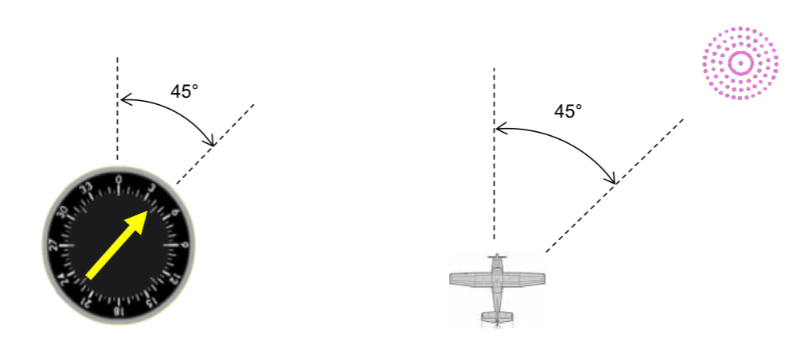

------------------------------------------------------------------------------------------------------------
# Automatic direction finder 

[More Reading](https://github.com/flyn28261/DuncanU/blob/main/ADF#more-reading)

[Videos](https://github.com/flyn28261/DuncanU/blob/main/ADF#Videos) 

[ADF Simulator](https://github.com/flyn28261/DuncanU/tree/main/ADF#online-simulators)

------------------------------------------------------------------------------------------------------------

An Automatic Direction Finder (ADF) is a radio-navigation instrument that provides continuous information about the relative bearing from the aircraft to a suitable radio station. ADF receivers are typically set to receive signals from aviation NDBs (Non-Directional Beacons) operating within the LW band, specifically between 190 – 535 kHz. While similar to RDF (Radio Direction Finder) units, ADF receivers can also pick up medium wave (AM) broadcast stations, although these are considered less reliable for navigation.

The operator tunes the ADF receiver to the correct frequency and confirms the identity of the beacon by listening to the Morse code signal emitted by the NDB. In older ADF receivers, a motorized ferrite-bar antenna situated on top of the unit (or in a remote location) would rotate and lock in place upon aligning with the desired station's null signal. This setup included a loop antenna on Amelia Earhart's Lockheed Model 10 Electra.

A bearing indicator on the antenna unit would move along a compass rose, indicating the station's bearing in degrees. In aviation ADFs, a compass-like pointer automatically adjusts to show the direction of the beacon. The pilot can use this pointer to navigate directly towards the beacon or determine the radial direction from the beacon to their aircraft using a magnetic compass.

Unlike the RDF, the ADF operates autonomously, continually displaying the direction of the tuned beacon. Initially, ADF receivers featured a rotating loop or ferrite loopstick antenna, driven by a motor controlled by the receiver. Similar to the RDF, a sense antenna confirmed the correct direction by observing the 180-degree opposite signal.

Modern aviation ADFs incorporate a fixed array of aerials and utilize electronic sensors to calculate direction based on the strength and phase of signals from each antenna. These sensors detect the trough that occurs when the antenna is perpendicular to the signal and relay the heading to the station through a direction indicator. During flight, the ADF's RMI or direction indicator always points towards the broadcast station, regardless of the aircraft's heading. However, dip error occurs when the aircraft is in a banked attitude, causing the needle to dip in the direction of the turn. This happens because the loop itself banks with the aircraft, resulting in a different angle to the beacon. To visualize this, consider a 90° banked turn with vertical wings. The beacon's bearing as observed from the ADF antenna will now be unrelated to the aircraft's direction to the beacon.

ADF receivers are employed to determine current position, track inbound and outbound flight paths, and intercept desired bearings. These procedures are also used for executing holding patterns and non-precision instrument approaches.

### More Reading
[Pilots Handbook of Aeronautical Knowledge](Pilots%Handbook%of%Aeronautical%Knowledge.pdf)

### Videos
[Understanding ADF](https://youtu.be/QQitucLrC8U?si=UZUXvmXRAXL9OD61)

### Online Simulators

[ADF Simulator](http://www.luizmonteiro.com/Learning_ADF_Sim.aspx)http://www.luizmonteiro.com/Learning_ADF_Sim.aspx

