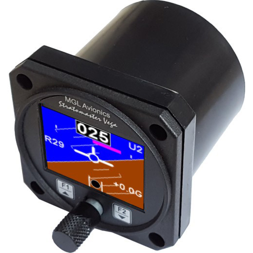
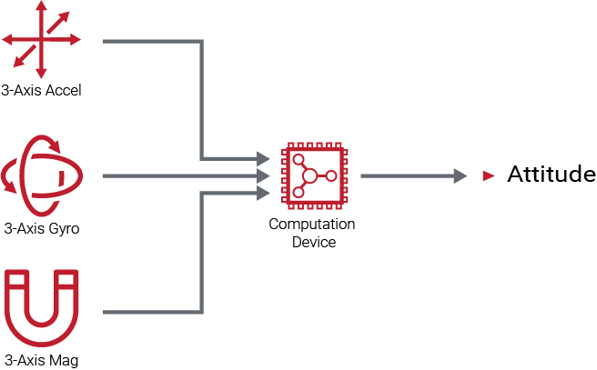

# Attitude and heading reference systems (AHRS)

[Read More](https://github.com/flyn28261/DuncanU/new/main#read-more)

[Video](https://github.com/flyn28261/DuncanU/new/main#video)

------------------------------------------------------------------------------------------------------------

Attitude and heading reference systems (AHRS) have been providing heading and attitude information with greater accuracy and reliability than traditional mechanical gyros for years now. But how do these solid-state systems deliver this information, and how do they do so using increasingly smaller and lighter equipment?

**Micro Electronics**

An AHRS’s key features include ­micro-electronic mechanical gyros, ­accelerometers and a magnetometer or flux valve. The micro-electronic mechanical gyros are responsible for capturing motion data as an aircraft moves about all three axes. They do this by ­using vibrating components. As an aircraft changes direction, these vibrations deviate, and these deviations can be measured and used to calculate directional change data.

**Gyro Drift**

In order to account for gyro drift, which can produce erroneous data, an AHRS must also rely on accelerometers as well as a magnetometer or flux valve. The former uses gravity to serve as both an initial attitude reference as well as an inflight reference, whereas the latter uses Earth’s magnetic field to provide heading information.

The AHRS aggregates all the information from these different components and conducts complex algorithms and calculations to provide highly reliable attitude and heading data.

## Read More

[AHRS](https://en.wikipedia.org/wiki/Attitude_and_heading_reference_system)

## Video

[AHRS SYSTEM EXPLAINED | Attitude and Heading Reference System](https://youtu.be/YO0m7O6DAww?si=F2dn0EHBfLvNzxDu)

[AHRS - Attitude and Heading Reference System](https://youtu.be/_-bP_N9Xt38?si=xoVKWX63ltiFBP0z)
