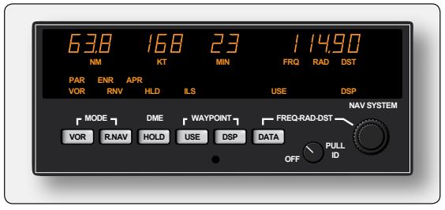
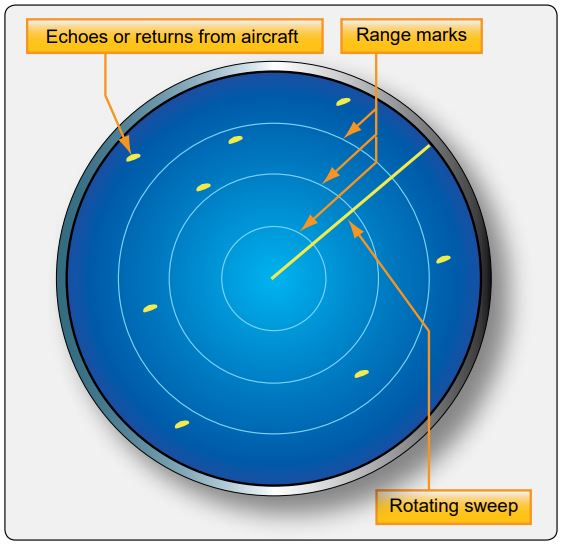
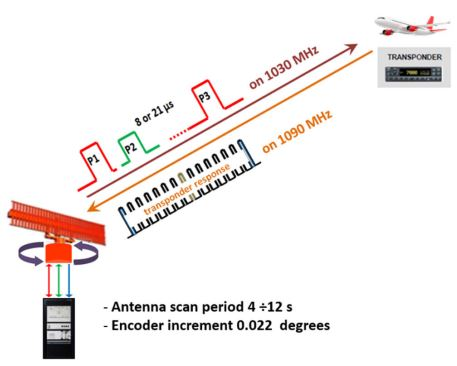
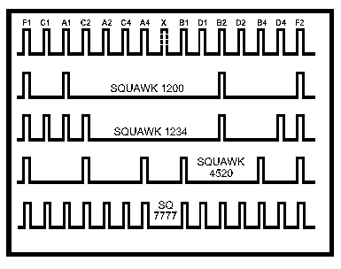
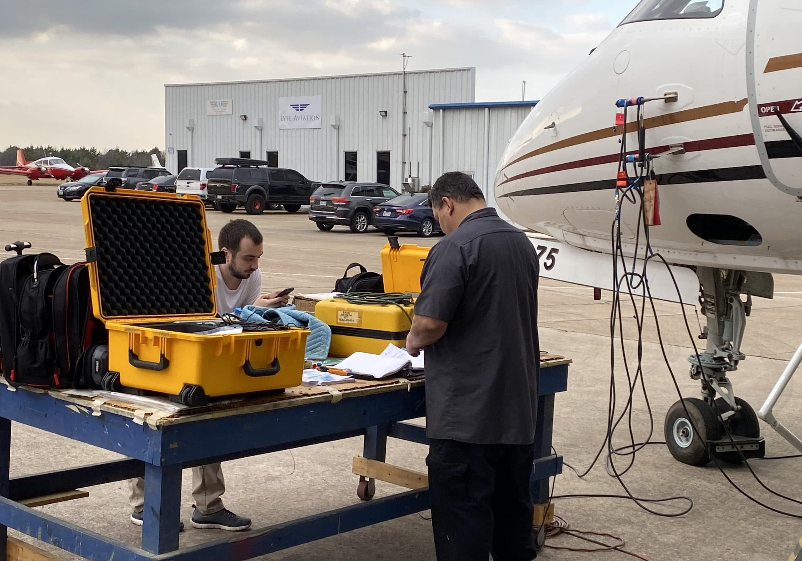
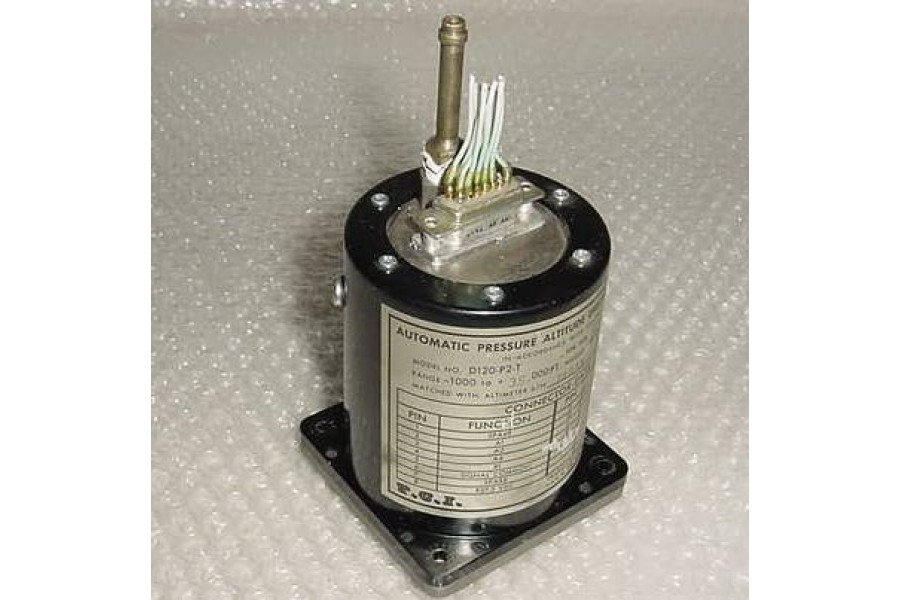
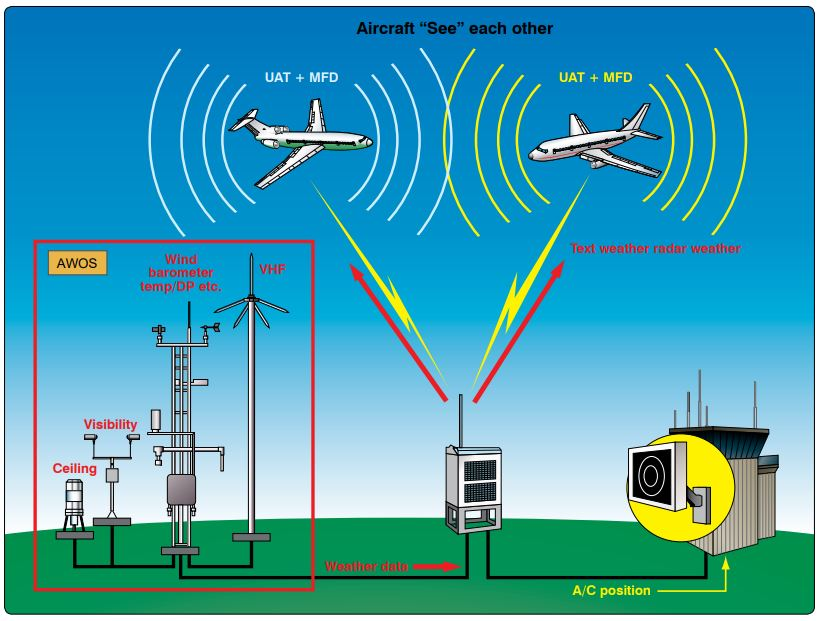

-----------------------------------------------------------------------------------------------------------
# Transponder

[Transponder Tests and Inspections](https://github.com/flyn28261/DuncanU/blob/main/ATC/readme.md#transponder-tests-and-inspections)

[Altitude Encoders](https://github.com/flyn28261/DuncanU/blob/main/ATC/readme.md#Altitude-Encoders)

[ADSB](https://github.com/flyn28261/DuncanU/blob/main/ATC/readme.md#adsb)

[ADSB](https://github.com/flyn28261/DuncanU/blob/main/ATC/readme.md#adsb-in)

[More Reading](https://github.com/flyn28261/DuncanU/blob/main/ATC/readme.md#more-reading-5)

[Videos](https://github.com/flyn28261/DuncanU/blob/main/ATC/readme.md#Videos-5)

-----------------------------------------------------------------------------------------------------------

A transponder (short for transmitter-responder and sometimes abbreviated to XPDR, XPNDR, TPDR or TP) is an electronic device that produces a response when it receives a radio-frequency interrogation. A transponder, provides positive identification and location of an aircraft on the radar screens of ATC. 

For each aircraft equipped with an altitude encoder, the transponder also provides the pressure altitude of the aircraft to be displayed adjacent to the on-screen blip that represents the aircraft.

Radar capabilities at airports vary. Generally, two types of radar are used by air traffic control (ATC). The primary radar transmits directional UHF or SHF radio waves sequentially in all directions. When the radio waves encounter an aircraft, part of those waves reflect back to a ground antenna. Calculations are made in a receiver to determine the direction and distance of the aircraft from the transmitter. A blip or target representing the aircraft is displayed on a radar screen also known as a plan position indicator (PPI). The azimuth direction and scaled distance from the tower are presented giving controllers a two dimensional fix on the aircraft.

A secondary surveillance radar (SSR) is used by ATC to verify the aircraft’s position and to add the third dimension of altitude to its location. SSR uses an active transponder (beacon) to transmit a response to an interrogation by a secondary radar. This response most often includes the aircraft's pressure altitude and a 4-digit octal identifier.

Mode 3/A pulses, as they are known, aid in confirming the location of the aircraft. A pilot may be requested to squawk a given code by an air traffic controller, via the radio, using a phrase such as "Cessna 123AB, squawk 0363". The pilot then selects the 0363 code on their transponder and the track on the air traffic controller's radar screen will become correctly associated with their identity. These are digital octal codes. The ground station transmits a pulse of energy at 1030 MHz and the transponder transmits a reply with the assigned code attached at 1090 MHz. This confirms the aircraft’s location typically by altering its target symbol on the radar screen. As the screen may be filled with many confirmed aircraft, ATC can also ask the pilot to ident. By pressing the IDENT button on the transponder, activates a special thirteenth bit on the mode A reply that causes the target symbol is highlighted on the radar scope and to be distinguishable.

To gain altitude clarification, the transponder control must be placed in the ALT or Mode C position. The signal transmitted back to ATC in response to pulse interrogation is then modified with a code that places the pressure altitude of the aircraft next to the target symbol on the radar screen. The transponder gets the pressure altitude of the aircraft from an altitude encoder that is electrically connected to the transponder. Typical aircraft transponder antennas are illustrated in Figure 

The aircraft transponder system described is known as Air Traffic Control Radar Beacon System (ATCRBS). To increase safety, Mode S altitude response has been developed. With Mode S, each aircraft is pre-assigned a unique identity code that displays along with its pressure altitude on ATC radar when the transponder responds to SSR interrogation.

## Transponder Tests and Inspections

Title 14 of the Code of Federal Regulations (CFR) part 91, section 91.413 states that all transponders on aircraft flown into controlled airspace are required to be inspected and tested in accordance with 14 CFR part 43, Appendix F, every 24 calendar months. Installation or maintenance that may introduce a transponder error is also cause for inspection and test in accordance with Appendix F. Only an appropriately rated repair station are approved to conduct the procedures. 

Operating a transponder in a hangar or on the ramp does not immunize it from interrogation and reply. Transmission of certain codes reserved for emergencies or military activity must be avoided. The procedure to select a code during ground operation is to do so with the transponder in the OFF or STANDBY mode to avoid inadvertent transmission. Code 0000 is reserved for military use and is a transmittable code. Code 7500 is used in a hijack situation and 7600 and 7700 are also reserved for emergency use. Even the inadvertent transmission of code 1200 reserved for VFR flight not under ATC direction could result in evasion action. All signals received from a radar beacon transponder are taken seriously by ATC.

## Altitude Encoders

Altitude encoders convert the aircraft’s pressure altitude into a code sent by the transponder to ATC. Increments of 100 feet are usually reported. Encoders have varied over the years. Some are built into the altimeter instrument used in the instrument panel and connected by wires to the transponder. Others are mounted out of sight on an avionics rack or similar out of the way place. These are known as blind encoders. Encoding information could also come from an air data computer (ADC).

When a transponder selector is set on ALT, the digital pulse message sent in response to the secondary surveillance radar interrogation becomes the digital representation of the pressure altitude of the aircraft. 

# ADSB

ADS-B is active in the United States and around the world. ADS-B is considered in two segments: ADS-B OUT and ADS-B IN. ADS-B OUT combines the positioning information available from a GPS receiver with on-board flight status information, i.e., location including altitude, velocity, and time. It then broadcasts this information to other ADS-B equipped aircraft and ground stations. 

Two different frequencies are used to carry these broadcasts with data link capability. The first is an expanded use of the 1090 MHz Mode-S transponder protocol known as 1090 ES. The second, largely being introduced as a new broadband solution for general aviation implementation of ADS-B, is at 978 MHz. A 978 universal access transceiver (UAT) is used to accomplish this. An omni-directional antenna is required in addition to the GPS antenna and receiver. Airborne receivers of an ADS-B broadcast use the information to plot the location and movement of the transmitting aircraft on a flight deck display similar to TCAS. 

Inexpensive ground stations (compared to radar) are constructed in remote and obstructed areas to proliferate ADS-B. Ground stations share information from airborne ADS-B broadcasts with other ground stations that are part of the air traffic management system (ATMS). Data is transferred with no need for human acknowledgement. Microwave and satellite transmissions are used to link the network.

For traffic separation and control, ADS-B has several advantages over conventional ground-based radar. The first is the entire airspace can be covered with a much lower expense. The aging ATC radar system that is in place is expensive to maintain and replace. Additionally, ADS-B provides more accurate information since the vector state is generated from the aircraft with the help of GPS satellites. Weather is a greatly reduced factor with ADS-B. Ultra-high frequency GPS transmissions are not affected. Increased positioning accuracy allows for higher density traffic flow and landing approaches, an obvious requirement to operate more aircraft in and out of the same number of facilities. The higher degree of control available also enables routing for fewer weather delays and optimal fuel burn rates. Collision avoidance is expanded to include runway incursion from other aircraft and support vehicles on the surface of an airport.

## ADS-B IN

ADS-B IN offers features not available in TCAS. Equipped aircraft are able to receive abundant data to enhance situational awareness. Traffic information services-broadcast (TIS-B) supply traffic information from non-ADS-B aircraft and ADS-B aircraft on a different frequency. Ground radar monitoring of surface targets, and any traffic data in the linked network of ground stations is sent via ADS-B IN to the flight deck. This provides a more complete picture than air-to-air only collision avoidance. Flight information services-broadcast (FIS-B) are also received by ADS-B IN. Weather text and graphics, ATIS information, and NOTAMS are able to be received in aircraft that have 987 UAT capability. 

### More Reading

[Mode A and Mode C Codes](Mode_A_and_Mode_C_Codes.pdf)http://www.aeroelectric.com/articles/Altitude_Encoding/modec.htm

[Radar Beacon Transponder](Aviation_Maintenance_Technician_Handbook–Airframe,_Volume_2.pdf)

### Videos

[Primary and Secondary Surveillance Radar](https://youtu.be/i4fIHHGp2zU?si=leMDIU0hTsa9VtfD)
[Secondary Surveillance Radar: Mode S](https://youtu.be/M_C2R4U-xug?si=v3dzMByYM6NHMz1-)
