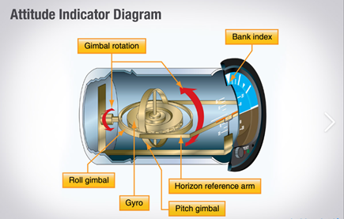
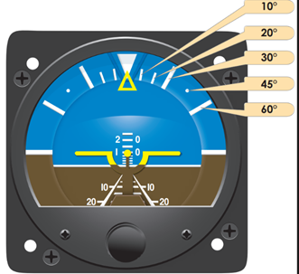

------------------------------------------------------------------------------------------------------------
# Attitude Indicator 

The attitude indicator is a gyroscopic flight instrument also known as the artificial horizon. It measures pitch and bank in relation to the horizon. It is a primary instrument for instrument flight rules (IFR) and is critical for maintaining control when visual references are limited, such as at night or in poor weather. Traditional attitude indicators use a gyroscope mounted horizontally inside the instrument. The gyroscope spins, typically powered by a vacuum system or electrically, and maintains rigidity in space, meaning it resists changes in orientation. The aircraft moves around the gyro, and the instrument translates this into a visual display with a miniature airplane symbol and horizon bar, showing the aircraft’s attitude relative to the horizon. Modern aircraft often use digital or glass cockpit systems with AHRS (Attitude and Heading Reference System) which provide electronic attitude information without moving parts, integrating data from multiple sensors for redundancy and accuracy.

## Reading the instrument

Horizontal bar: represents the horizon

Miniature aircraft symbol: shows the aircrafts position relative to the horizon.

Bank index: Is the arrow pointing down on the top of the instrument.

Roll pointer: is the arrow pointing up towards the bank index. Each tick mark in either direction indicates 10 degrees of bank angle.

Pitch indication: is the dot in the middle of the miniature aircraft symbol. When the dot is in the center of the horizon that means the pitch angle is 0 degrees and each big tick mark after is 10 degrees.

More Reading

Videos

------------------------------------------------------------------------------------------------------------

### More Reading

### Videos
[How the Attitude Indicator Works (Private Pilot Ground Lesson 29)](https://www.youtube.com/watch?v=ZBU55yIje-Y&t=10s)
