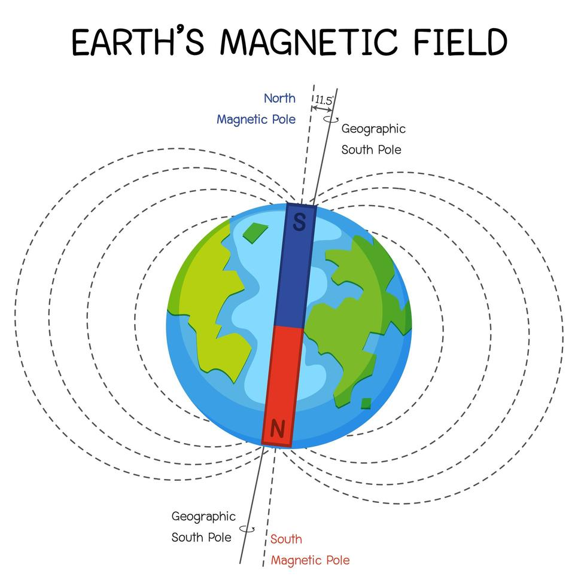
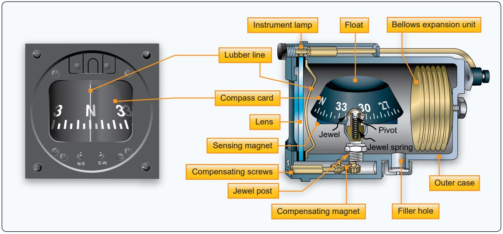
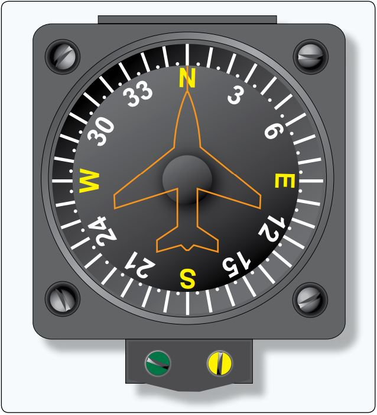
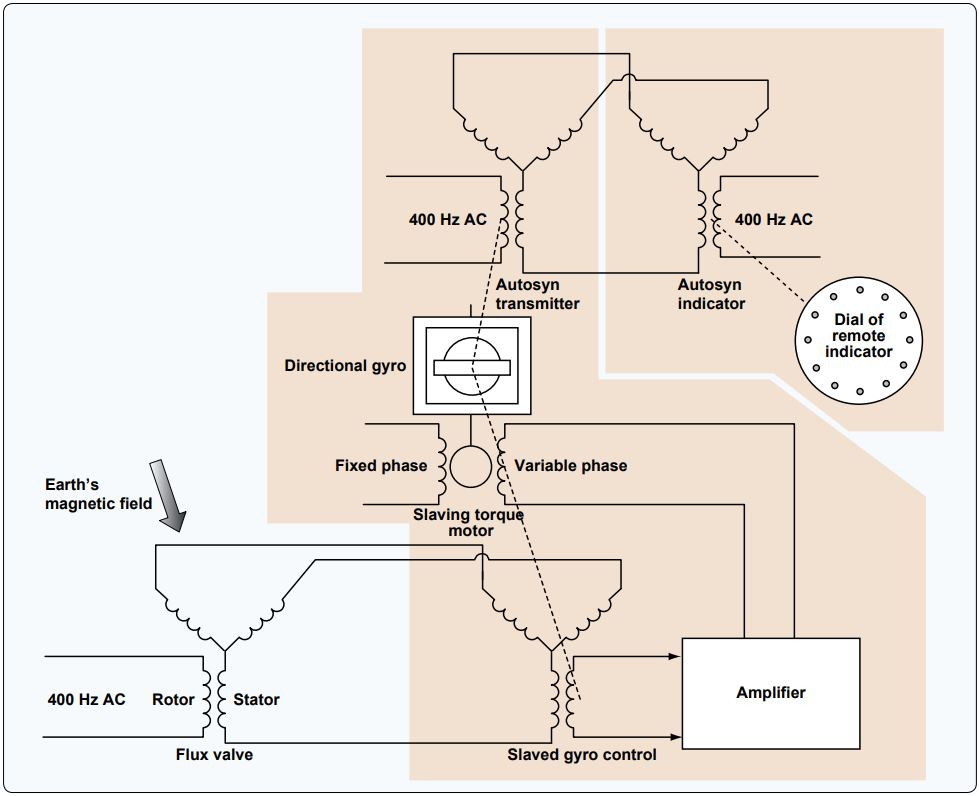

-----------------------------------------------------------------------------------------------------------
# Compass

[Magnetic Compass](https://github.com/flyn28261/DuncanU/blob/main/Compass/readme.md#magnetic-compass)

[Remote Indicating Slaved Gyro Compass (Flux Gate Compass)](https://github.com/flyn28261/DuncanU/blob/main/Compass/readme.md#Remote-Indicating-Slaved-Gyro-Compass-Flux-Gate-Compass)

[Solid State Magnetometers](https://github.com/flyn28261/DuncanU/blob/main/Compass/readme.md#Solid-State-Magnetometers)

[More Reading](https://github.com/flyn28261/DuncanU/blob/main/Compass/readme.md#more-reading-3)

[Videos](https://github.com/flyn28261/DuncanU/blob/main/Compass/readme.md#Videos-3)

-----------------------------------------------------------------------------------------------------------

## Magnetic Compass 

The magnetic compass is a direction finding instrument that has been used for navigation for hundreds of years. It is a simple instrument that takes advantage of the earth’s magnetic field.

The magnetic north pole is very close to the geographic North Pole of the globe, but they are not the same. An ordinary permanent magnet that is free to do so, aligns itself with the direction of the earth’s magnetic field. Upon this principle, an instrument is constructed that the pilot can reference for directional orientation. Permanent magnets are attached under a float that is mounted on a pivot so it is free to rotate in the horizontal plane. As such, the magnets align with the earth’s magnetic field. A numerical compass card, usually graduated in 5° increments, is constructed around the perimeter of the float. It serves as the instrument dial.

The entire assembly is enclosed in a sealed case that is filled with a liquid similar to kerosene. This dampens vibration and oscillation of the moving float assembly and decreases friction.

There are accuracy issues associated with using a magnetic compass. The main magnets of a compass align not only with the earth’s magnetic field, they actually align with the composite field made up of all magnetic influences around them, meaning local electromagnetic influence from metallic structures near the compass and operation of the aircraft’s electrical system. This is called magnetic deviation. It causes a magnet’s alignment with the earth’s magnetic field to be altered. Compensating screws are turned, which move small permanent magnets in the compass case to correct for this

magnetic deviation. The two set-screws are on the face of the instrument and are labeled N-S and E-W. They position the small magnets to counterbalance the local magnetic influences acting on the main compass magnets.

The process for knowing how to adjust for deviation is known as swinging the compass. 

## Remote Indicating Slaved Gyro Compass (Flux Gate Compass)

An elaborate and very accurate method of direction indication has been developed that combines the use of a gyro, a magnetic compass, and a remote indicating system.  It is called the slaved gyro compass or flux gate compass system. 

A gyroscopic direction indicator is augmented by magnetic direction information from a remotely located compass. The type of compass used is called a flux valve or flux gate compass. It consists of a very magnetically permeable circular segmented core frame or spider. The earth’s magnetic field flows through this iron core and varies its distribution through segments of the core as the flux valve is rotated via the movement of the aircraft. Pickup coil windings are located on each of the core’s spider legs that are positioned 120° apart.

The distribution of earth’s magnetic field flowing through the legs is unique for every directional orientation of the aircraft. A coil is placed in the center of the core and is energized by AC current. As the AC flow passes through zero while changing direction, the earth’s magnetic field is allowed to flow through the core. Then, it is blocked or gated as the magnetic field of the core current flow builds to its peak again. The cycle is repeated at the frequency of the AC supplied to the excitation coil. The result is repeated flow and nonflow of the earth’s flux across the pickup coils. During each cycle, a unique voltage is induced in each of the pickup coils reflecting the orientation of the aircraft in the earth’s magnetic field.

The electricity that flows from each of the pickup coils is transmitted out of the flux valve via wires into a second unit. It contains an autosyn transmitter, directional gyro, an amplifier, and a triple wound stator that is similar to that found in the indicator of a synchro system. Unique voltage is induced in the center rotor of this stator which reflects the voltage received from the flux valve pickup coils sent through the stator coils. It is amplified and used to augment the position of the DG. The gyro is wired to be the rotor of an autosyn synchro system, which transmits the position of the gyro into an indicator unit located in the cockpit. In the indicator, a vertical compass card is rotated against a small airplane type lubber line like that in a vertical magnetic compass.

## Solid State Magnetometers

Solid state magnetometers are used on many modern aircraft. They have no moving parts and are extremely accurate. Tiny layered structures react to magnetism on a molecular level resulting in variations in electron activity. These low power consuming devices can sense not only the direction to the earth’s magnetic poles, but also the angle of the flux field. They are free from oscillation that plagues a standard magnetic compass. They feature integrated processing algorithms and easy integration with digital systems. 
 

### More Reading

### Videos

[Heading Indicator (Directional Gyro)](https://youtu.be/q1TVR9xdl64?si=ubQ4j7hgkn6LtXO9)
[Gyro Magnetic Compass Flux Valve](https://youtu.be/nRz3fbaIxxQ?si=SYe-jsu7AIsZ8beH)
