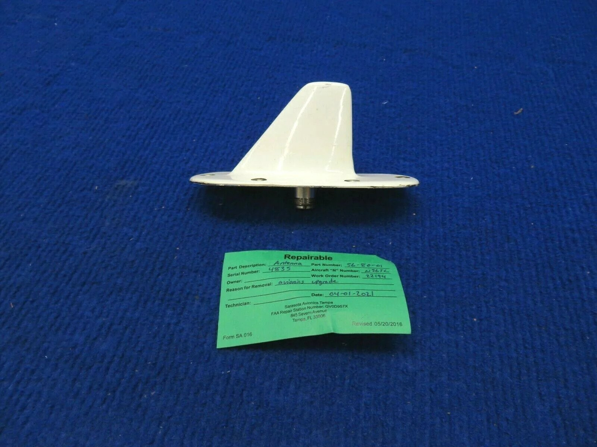
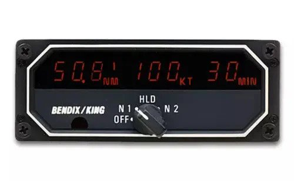

-------------------------------------------------------------------------------------------------------------
# Distance Measuring  Equipment 

[Operation](https://github.com/flyn28261/DuncanU/tree/main/DME#Operation)

[Distance calculation](https://github.com/flyn28261/DuncanU/tree/main/DME#Distance-calculation)

[Radio frequency and modulation data](https://github.com/flyn28261/DuncanU/tree/main/DME#Radio-frequency-and-modulation-data)

[Frequency usage/channelization](https://github.com/flyn28261/DuncanU/tree/main/DME#Frequency-usagechannelization)

[More Reading](https://github.com/flyn28261/DuncanU/tree/main/DME#more-reading-2)

[Videos](https://github.com/flyn28261/DuncanU/tree/main/DME#Videos-2)

------------------------------------------------------------------------------------------------------------

In aviation, distance measuring equipment (DME) is a radio navigation technology that measures the slant range (distance) between an aircraft and a ground station by timing the propagation delay of radio signals in the frequency band between 960 and 1215 megahertz (MHz). Line-of-visibility between the aircraft and ground station is required. An interrogator (airborne) initiates an exchange by transmitting a pulse pair, on an assigned 'channel', to the transponder ground station. The channel assignment specifies the carrier frequency and the spacing between the pulses. After a known delay, the transponder replies by transmitting a pulse pair on a frequency that is offset from the interrogation frequency by 63 MHz and having specified separation.

DME systems are used worldwide, using standards set by the International Civil Aviation Organization (ICAO), the European Union Aviation Safety Agency (EASA) and other bodies. 

While stand-alone DME transponders are permitted, DME transponders are usually paired with an azimuth guidance system to provide aircraft with a two-dimensional navigation capability. A common combination is a DME colocated with a VHF omnidirectional range (VOR) transmitter in a single ground station. When this occurs, the frequencies of the VOR and DME equipment are paired. Such a configuration enables an aircraft to determine its azimuth angle and distance from the station. 

ICAO characterizes DME transmissions as ultra high frequency (UHF). The term L-band is also used.

## Operation

In its first iteration, a DME-equipped airplane used the equipment to determine and display its distance from a land-based transponder by sending and receiving pulse pairs. The ground stations are typically collocated with VORs or VORTACs. 

A newer role for DMEs is DME/DME area navigation (RNAV).[6][7] Owing to the generally superior accuracy of DME relative to VOR, navigation using two DMEs (using trilateration/distance) permits operations that navigating with VOR/DME (using azimuth/distance) does not. However, it requires that the aircraft have RNAV capabilities, and some operations also require an inertial reference unit.

## Distance calculation

A radio signal takes approximately 12.36 microseconds to travel 1 nautical mile (1,852 m) to the target and back. The time difference between interrogation and reply, minus the 50 microsecond ground transponder delay and the pulse width of the reply pulses (12 microseconds in X mode and 30 microseconds in Y mode), is measured by the interrogator's timing circuitry and converted to a distance measurement (slant range), in nautical miles, then displayed on the cockpit DME display.

The distance formula, distance = rate * time, is used by the DME receiver to calculate its distance from the DME ground station. The rate in the calculation is the velocity of the radio pulse, which is the speed of light (roughly 300,000,000 m/s or 186,000 mi/s). The time in the calculation is ½(total time − reply delay).

## Radio frequency and modulation data

DME frequencies are paired to VOR frequencies and a DME interrogator is designed to automatically tune to the corresponding DME frequency when the associated VOR frequency is selected. An airplane's DME interrogator uses frequencies from 1025 to 1150 MHz. DME transponders transmit on a channel in the 962 to 1213 MHz range and receive on a corresponding channel between 1025 and 1150 MHz. The band is divided into 126 channels for interrogation and 126 channels for reply. The interrogation and reply frequencies always differ by 63 MHz. The spacing of all channels is 1 MHz with a signal spectrum width of 100 kHz.

Technical references to X and Y channels relate only to the spacing of the individual pulses in the DME pulse pair, 12 microsecond spacing for X channels and 30 microsecond spacing for Y channels.

DME facilities identify themselves with a 1,350 Hz Morse code three letter identity. If collocated with a VOR or ILS, it will have the same identity code as the parent facility. Additionally, the DME will identify itself between those of the parent facility. The DME identity is 1,350 Hz to differentiate itself from the 1,020 Hz tone of the VOR or the ILS localizer.

## Frequency usage/channelization

DME frequency usage, channelization and pairing with other navaids (VOR, ILS, etc.) are defined by ICAO. 252 DME channels are defined by the combination of their interrogation frequency, interrogation pulse spacing, reply frequency, and reply pulse spacing. These channels are labeled 1X, 1Y, 2X, 2Y, ... 126X, 126Y. X channels (which came first) have both interrogation and reply pulse pairs spaced by 12 microseconds. Y channels (which were added to increase capacity) have interrogation pulse pairs spaced by 36 microseconds and reply pulse pairs spaced by 30 microseconds.

A total of 252 frequencies are defined (but not all used) for DME interrogations and replies—specifically, 962, 963, ... 1213 megahertz. Interrogation frequencies are 1025, 1026, ... 1150 megahertz (126 total), and are the same for X and Y channels. For a given channel, the reply frequency is 63 megahertz below or above the interrogation frequency. The reply frequency is different for X and Y channels, and different for channels numbered 1-63 and 64-126.

Not all defined channels/frequencies are assigned. There are assignment 'holes' centered on 1030 and 1090 megahertz to provide protection for the secondary surveillance radar (SSR) system. In many countries, there is also an assignment 'hole' centered on 1176.45 megahertz to protect the GPS L5 frequency. These three 'holes' remove approximately 60 megahertz from the frequencies available for use.

Precision DME (DME/P), a component of the Microwave Landing System, is assigned to Z channels, which have a third set of interrogation and reply pulse spacings. The Z channels are multiplexed with the Y channels and do not materially affect the channel plan.

### More Reading

### Videos
[Distance Measuring Equipment](https://youtu.be/wMmooAYr9sw?si=bqWSsvgKMyMLXZvk)

[DME](https://youtu.be/CEpoCVGk1UQ?si=HjiNIj6QVjT1fCE7)
