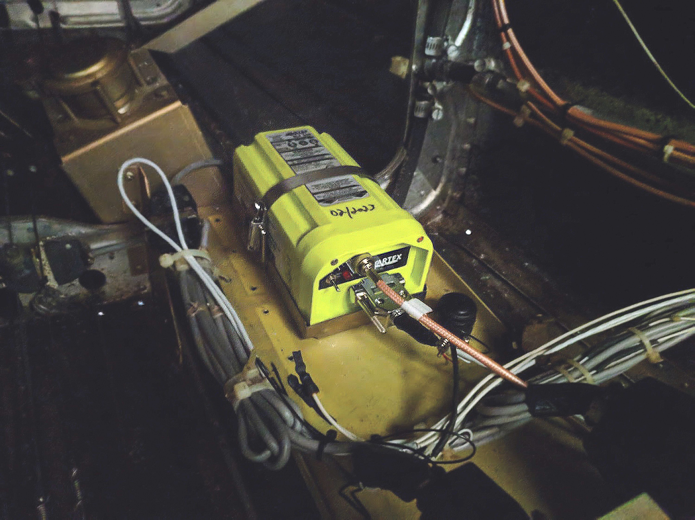
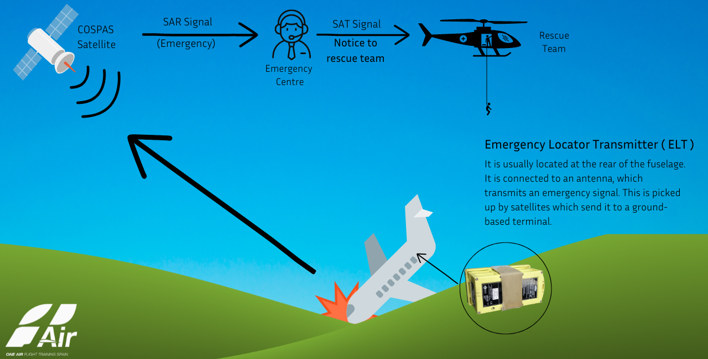
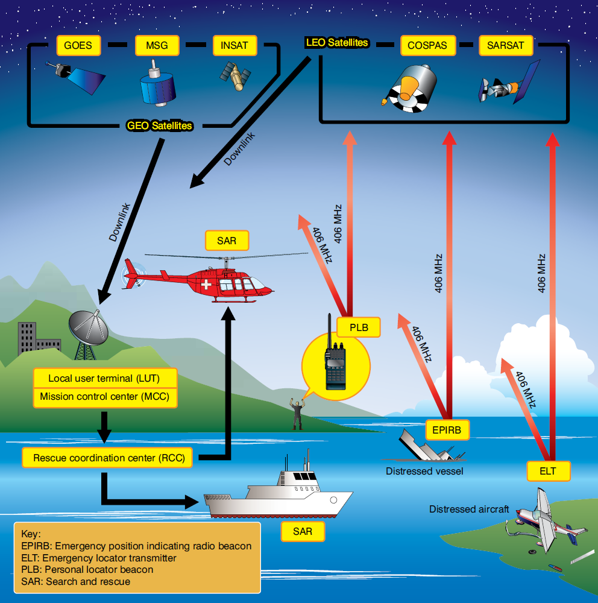
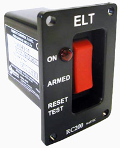

------------------------------------------------------------------------------------------------------------
# ELT 

More Reading

Videos

------------------------------------------------------------------------------------------------------------

An [Emergency Locator Transmitter (ELT)](https://en.wikipedia.org/wiki/Emergency_locator_transmitter) is a self-contained, battery-powered device designed to activate upon experiencing excessive G-forces during a crash. It transmits a digital signal every 50 seconds at a frequency of [406.025 MHz](https://en.wikipedia.org/wiki/Megahertz) with an output power of 5 watts, lasting for a minimum of 24 hours. This signal is received globally by satellites in the [COSPAS-SARSAT satellite system](https://en.wikipedia.org/wiki/COSPAS-SARSAT). The system employs two types of satellites: [Low Earth Orbiting (LEOSATs)](https://en.wikipedia.org/wiki/Low_Earth_orbit) and [Geostationary Satellites (GEOSATs)](https://en.wikipedia.org/wiki/Geostationary_satellite). Each type offers distinct but complementary capabilities.

The received signal is partially processed and stored in the satellites before being relayed to ground stations, known as [Local User Terminals (LUTs)](https://en.wikipedia.org/wiki/Local_User_Terminal). Further signal decoding occurs at the LUTs, notifying mission control centers (MCCs) for necessary search and rescue operations. Notably, maritime vessel emergency locating beacons (EPIRBs) and personal locator beacons (PLBs) also utilize this same system. In the United States, the COSPAS-SARSAT system is managed and operated by [NOAA](https://en.wikipedia.org/wiki/National_Oceanic_and_Atmospheric_Administration).

ELTs are mandated for installation in aircraft according to [FAR 91.207](https://en.wikipedia.org/wiki/Federal_Aviation_Regulations). This requirement applies to most general aviation aircraft not operating under parts 135 or 121. ELTs must undergo inspection within 12 months of the previous one to ensure proper installation, check for battery corrosion, verify control and crash sensor operation, and confirm the presence of a sufficient signal at the antenna. Built-in test equipment allows for testing without actual transmission of an emergency signal. The remainder of the inspection is visual and technicians are warned against activating the ELT to prevent the transmission of a false emergency distress signal. Inspection details, including the new battery expiration date, must be recorded in maintenance logs, as well as on the exterior of the ELT.

ELTs are typically situated as far aft in the fuselage of an aircraft as practicable, just forward of the empennage. The built-in G-force sensor aligns with the aircraft's longitudinal axis. For helicopters, ELTs may be located elsewhere on the airframe and are equipped with multidirectional activation devices. Proper installation, inspection, and maintenance of ELTs should follow the instructions provided by both the ELT and airframe manufacturers. By employing Doppler technology, the origin of the 406 MHz ELT signal can be calculated within a range of 2 to 5 kilometers. Second-generation 406 MHz ELTs digitally transmit GPS location coordinates obtained from a receiver inside the ELT unit or integrated from an external unit, thereby enhancing crash site location accuracy to within 100 meters. Additionally, the digital signal carries unique registration information, including aircraft identification, owner details, and contact information. This information is crucial for promptly verifying the validity of an alert, ensuring that rescue resources are deployed only when genuinely needed.

ELTs equipped with automatic G-force activation and mounted in aircraft are easily removable and often feature a portable antenna, enabling crash victims to relocate while carrying the operating ELT. A flight deck mounted panel is essential for alerting the pilot when the ELT is activated, and it also allows for arming, testing, and manual activation of the ELT if necessary. Modern ELTs may additionally transmit a signal on 121.5 MHz, an analog transmission used for homing. Before 2009, 121.5 MHz served as a worldwide emergency frequency monitored by CORPAS-SARSAT satellites, but it has since been replaced by the 406 MHz standard. Transmission on 121.5 MHz is no longer received and relayed via satellite, though it remains an active emergency frequency monitored by overflying aircraft and control towers. Technicians are mandated to conduct an inspection/test of 121.5 MHz ELTs within 12 months of the previous one, assessing their integrity much like the 406 MHz ELTs mentioned earlier. However, older ELTs may lack the built-in test circuitry of modern ELTs certified to TSO C-126, necessitating an operational test, which may involve activating the signal. This should only be done between the top of each hour and 5 minutes after the hour, and the activation duration should not exceed three audible sweeps. It is recommended to coordinate with the local control tower or flight service station before conducting the test. It's important to note that older 121.5 MHz analog signal ELTs often also transmit an emergency signal on a frequency of 243.0 MHz, which has traditionally been the military emergency frequency. However, this frequency is being phased out in favor of digital ELT signals and satellite monitoring. The significant improvements in coverage, location accuracy, identification of false alerts, and shortened response times with 406 MHz ELTs have established them as the current worldwide service standard. While the FAA has not mandated the use of a 406 MHz ELT, an older 121.5 MHz ELT fulfills the requirements of FAR Part 91.207 for all aircraft except new ones. Thousands of aircraft registered in the United States are still equipped with ELTs that transmit a 0.75 watt analog 121.5 MHz emergency signal upon activation. The 121.5 MHz frequency continues to be a functional emergency frequency, monitored by overflying aircraft and control towers.

### More Reading

### Videos

