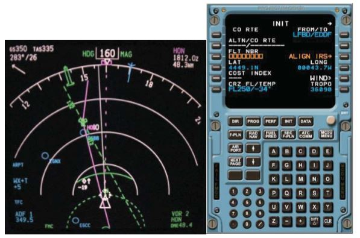
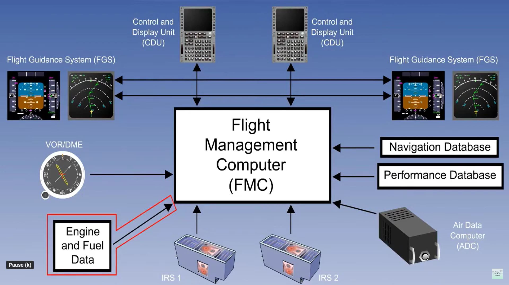

# Flight management system

[Navigation database](https://github.com/flyn28261/DuncanU/blob/main/FMS/README.md#navigation-database)

[Flight plan](https://github.com/flyn28261/DuncanU/blob/main/FMS/README.md#flight-plan)

[Position determination](https://github.com/flyn28261/DuncanU/blob/main/FMS/README.md#position-determination)

[Read More](https://github.com/flyn28261/DuncanU/blob/main/FMS/README.md#read-more)

[Videos](https://github.com/flyn28261/DuncanU/blob/main/FMS/README.md#videos)

---------------------------------------------------------------------------------------------------------------

A flight management system (FMS) is a fundamental component of a modern aircraft’s avionics. An FMS is a specialized computer system that automates a wide variety of in-flight tasks, reducing the workload on the flight crew. A primary function is in-flight management of the flight plan. Using various sensors (such as GPS and INS often backed up by radio navigation) to determine the aircraft's position, the FMS can guide the aircraft along the flight plan. From the cockpit, the FMS is normally controlled through a Control Display Unit (CDU) which incorporates a small screen and keyboard or touchscreen. The FMS sends the flight plan for display to the Electronic Flight Instrument System (EFIS), Navigation Display (ND), or Multifunction Display (MFD). The FMS can be summarized as being a dual system consisting of the Flight Management Computer (FMC), CDU and a cross talk bus.

### Navigation database
All FMSs contain a navigation database. The navigation database contains the elements from which the flight plan is constructed. The navigation database (NDB) is normally updated every 28 days, in order to ensure that its contents are current. 

The NDB contains all of the information required for building a flight plan, consisting of:
- Waypoints/Intersection
- Airways
- Radio navigation aids including distance measuring equipment (DME), VHF omnidirectional range (VOR), non-directional beacons (NDBs) and instrument landing systems (ILSs).
- Airports
- Runways
- Standard instrument departure (SID)
- Standard terminal arrival (STAR)
- Holding patterns (only as part of IAPs-although can be entered by command of ATC or at pilot's discretion)
- Instrument approach procedure (IAP)

Waypoints can also be defined by the pilot(s) along the route or by reference to other waypoints with entry of a place in the form of a waypoint (e.g. a VOR, NDB, ILS, airport or waypoint/intersection).

### Flight plan
The flight plan is generally determined on the ground, before departure by the Pilot. It is entered into the FMS either by typing it in, selecting it from a saved library of common routes or via an ACARS datalink.

During preflight, other information relevant to managing the flight plan is entered. This can include performance information such as gross weight, fuel weight and center of gravity. It will include altitudes including the initial cruise altitude. 

### Position determination
Once in flight, a principal task of the FMS is obtaining a position fix, i.e., to determine the aircraft's position and the accuracy of that position. Simple FMS use a single sensor, generally GPS in order to determine position. But modern FMS use as many sensors as they can, such as VORs, in order to determine and validate their exact position. 

Common sensors include:
- GPS receivers 
- Radio aids designed for aircraft navigation
-  DME (distance measuring equipment)
-  VORs
-  Inertial reference systems (IRS)

The FMS constantly crosschecks the various sensors and determines a single aircraft position and accuracy. The accuracy is described as the Actual Navigation Performance (ANP) a circle that the aircraft can be anywhere within measured as the diameter in nautical miles. Modern airspace has a set required navigation performance (RNP). The aircraft must have its ANP less than its RNP in order to operate in certain high-level airspace.

## Read More

## Videos

[Flight Management Systems Explained](https://youtu.be/qC3HRRezJo4?si=ReYG7O6xDP1gXe6B)

[Honeywell FMS 6.1 Generic Features Part 1| Aero Training TV |]( Honeywell Aerospacehttps://youtu.be/bRKyqXk9WSA?si=bYo7jR1XlVcHqvS6)

[Honeywell FMS 6.1 Generic Features Part 2 | Aero Training TV | Honeywell Aerospace](https://youtu.be/t4G3usxEKF4?si=kxu9Q4mWEVUTZWs6)
