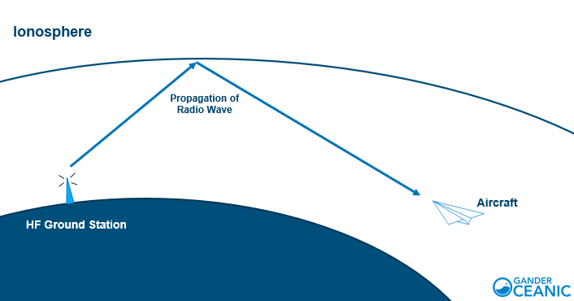
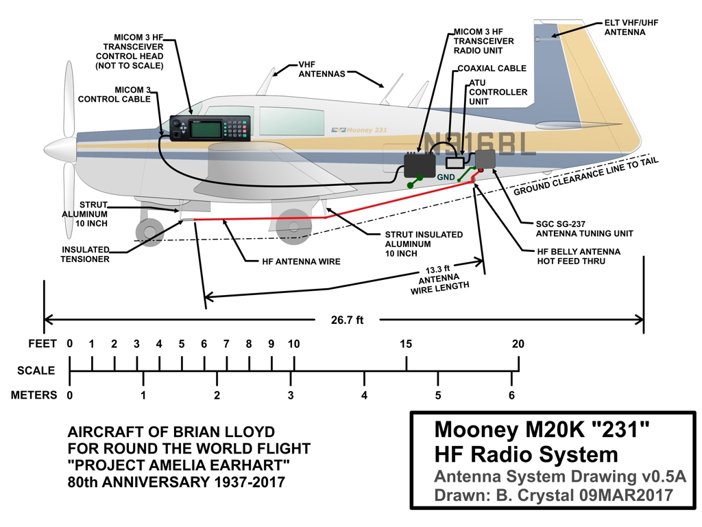
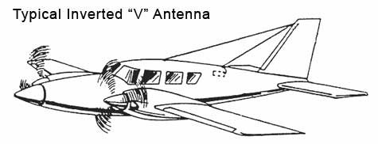
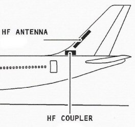

------------------------------------------------------------------------------------------------------------
# HF COMM 

High Frequency (HF) theory 

More Reading

Videos

------------------------------------------------------------------------------------------------------------

## High Frequency (HF) theory

encompasses the principles governing electromagnetic waves within the frequency range of approximately [3 to 30 megahertz (MHz)](https://en.wikipedia.org/wiki/High_frequency). In this band, radio waves exhibit unique propagation characteristics, influenced by factors like [ionospheric reflection](https://en.wikipedia.org/wiki/Ionosphere) and [refraction](https://en.wikipedia.org/wiki/Atmospheric_refraction). HF waves possess the capacity to travel vast distances by utilizing the Earth's ionosphere to refract and reflect signals back to the surface. This phenomenon, known as [skywave propagation](https://en.wikipedia.org/wiki/Skywave), allows for long-range communication beyond the line of sight. However, HF signals are also susceptible to various atmospheric conditions, such as [solar activity](https://en.wikipedia.org/wiki/Solar_activity) and [geomagnetic disturbances](https://en.wikipedia.org/wiki/Geomagnetic_storm), which can impact their reliability. Understanding HF theory is crucial in fields like long-range communication, aviation, and marine navigation, where effective use of HF frequencies is essential for reliable information exchange over extended distances.

An **HF Communication (Com) System** in an aircraft enables long-range voice communication between the aircraft and ground stations or other aircraft using [High Frequency (HF)](https://en.wikipedia.org/wiki/High_frequency) radio waves. Here's how an HF Com system works:

1. **Microphone and Audio System**:
   - The process starts with a microphone in the cockpit, which converts the pilot's voice into an electrical audio signal.

2. **Audio Amplification and Processing**:
   - The audio signal is then amplified and processed to ensure clarity and quality.

3. **Modulation**:
   - The processed audio signal is used to modulate a carrier wave within the HF frequency band (typically between [2.000 to 30.000 MHz](https://en.wikipedia.org/wiki/High_frequency)).

4. **Transmitter**:
   - The modulated signal is sent to the transmitter, which generates the radio frequency (RF) signal for transmission.

5. **Antenna**:
   - The RF signal is then sent to the aircraft's [antenna](https://en.wikipedia.org/wiki/Antenna_(radio)).

6. **Transmission**:
   - The antenna radiates the RF signal into space, where it propagates as electromagnetic waves.

7. **Reception at Receiver**:
   - On the receiving end (either on the ground or in another aircraft), the transmitted signal is captured by an [antenna](https://en.wikipedia.org/wiki/Antenna_(radio)).

8. **Demodulation**:
   - The received signal is then demodulated to retrieve the original audio signal.

9. **Audio Amplification and Processing (Again)**:
   - The demodulated audio signal is amplified and processed to prepare it for playback.

10. **Speaker and Headset**:
    - The processed audio signal is then sent to [speakers](https://en.wikipedia.org/wiki/Loudspeaker) or [headsets](https://en.wikipedia.org/wiki/Headset_(audio)) , allowing the recipient (pilot or air traffic controller) to hear the communication.

11. **Simplex Communication**:
    - HF Com systems are typically simplex, meaning they allow for communication in one direction at a time. This requires users to take turns transmitting and receiving.

12. **Frequency Selection**:
    - Pilots can select specific frequencies on the HF Com radio to communicate with different air traffic control facilities or other aircraft.

Overall, the HF Com system enables long-range voice communication in aviation, allowing pilots to establish contact over considerable distances. This capability is particularly crucial in regions where VHF communication may not be reliable due to the limitations of line-of-sight propagation. HF frequencies can be reflected by the ionosphere, allowing for long-distance communication even when direct line-of-sight is not possible. This makes the HF Com system an essential tool for aircraft operating in remote or oceanic regions.

## Amplitude Modulation (AM)

is a fundamental technique in the field of [telecommunications](https://en.wikipedia.org/wiki/Telecommunication). It involves encoding information on a carrier wave by varying the amplitude of the wave in proportion to the waveform being transmitted. In AM, the strength or height of the carrier wave is modified in accordance with the signal being sent. This modulation technique allows for the simultaneous transmission of audio or data over long distances. The receiver then demodulates the signal, extracting the original information. AM has been historically used in [radio broadcasting](https://en.wikipedia.org/wiki/Amplitude_modulation_broadcasting) and is known for its relatively simple implementation. Despite advancements in modulation techniques, AM remains a critical aspect of communication, particularly in specific applications such as [shortwave broadcasting](https://en.wikipedia.org/wiki/Shortwave_bands) and [aviation communication](https://en.wikipedia.org/wiki/Airband).

## Single Sideband (SSB)

is a modulation technique used in radio communications. Unlike amplitude modulation (AM), which transmits both sidebands and the carrier signal, SSB transmits only one sideband, significantly reducing bandwidth requirements. This results in more efficient use of radio spectrum. SSB is widely employed in long-distance and high-frequency communication, particularly in applications such as amateur radio, marine radio, and aviation communication. It offers greater range and signal clarity compared to AM, making it an important tool for reliable communication over extended distances.

## Selective Calling (SELCAL)

is a vital communication system used in aviation to streamline long-distance radio transmissions. It operates by assigning a unique code to an aircraft, which is registered with air traffic control or a ground station. When a message is sent over a long-range radio frequency, it includes the [SELCAL code](https://en.wikipedia.org/wiki/SELCAL) of the intended recipient. Upon reception, the aircraft's SELCAL system listens for its specific code. When a match is found, it triggers an alert to the flight crew, indicating that a message is intended for their aircraft. This selective alerting mechanism helps reduce the continuous monitoring of radio frequencies, allowing pilots to attend to other crucial tasks without missing important messages. SELCAL technology significantly enhances the efficiency and reliability of air-to-ground communications, especially over extended flight paths where continuous monitoring of radio frequencies may not be practical.

### More Reading

### Videos

[HF Communication Systems ATA23 (Long Distance Communication)](https://youtu.be/ttqLIDBGlEA?si=k5pUx7W8H4Zwl3eE)
