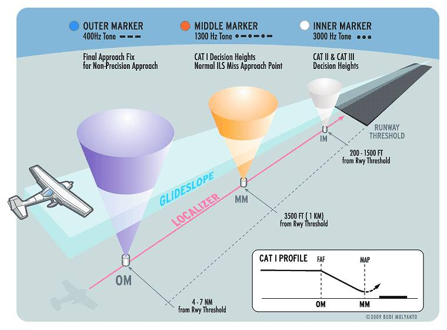

-----------------------------------------------------------------------------------------------------------
# **Insterments Landing System (ILS)**

[Localizer](https://github.com/flyn28261/DuncanU/tree/main/ILS#localizer-loc)

[Glideslope](https://github.com/flyn28261/DuncanU/tree/main/ILS#glideslope-gs)

[Marker Beacons](https://github.com/flyn28261/DuncanU/tree/main/ILS#marker-beacons-mb)

[More Reading](https://github.com/flyn28261/DuncanU/edit/main/ILS#more-reading)

[Videos](https://github.com/flyn28261/DuncanU/edit/main/ILS#videos)

-----------------------------------------------------------------------------------------------------------

## Insterments Landing System (ILS)

An ILS is used to land an aircraft when visibility is poor. This radio navigation system guides the aircraft down a slope to the touch down area on the runway. Multiple radio transmissions are used that enable an exact approach to landing with an ILS. A localizer is one of the radio transmissions. It is used to provide horizontal guidance to the center line of the runway. A separate glideslope broadcast provides vertical guidance of the aircraft down the proper slope to the touch down point. Compass locator transmissions for outer and middle approach marker beacons aid the pilot in intercepting the approach navigational aid system. Marker beacons provide distance from-the-runway information. Together, all of these radio signals make an ILS a very accurate and reliable means for landing aircraft. 

### **Localizer (LOC)** 

The localizer broadcast is a VHF broadcast in the lower range of the VOR frequencies (108 MHz–111.95 MHz) on odd frequencies only. Two modulated signals are produced from a horizontally polarized antenna complex beyond the far end of the approach runway. They create an expanding field that is 21 ⁄2° wide (about 1,500 feet) 5 miles from the runway. The field tapers to runway width near the landing threshold. The left side of the approach area is filled with a VHF carrier wave modulated with a 90 Hz signal. The right side of the approach contains a 150 MHz modulated signal. The aircraft’s VOR receiver is tuned to the localizer VHF frequency that can be found on published approach plates and aeronautical charts.

The circuitry specific to standard VOR reception is inactive while the receiver uses localizer circuitry and components common to both. The signals received are passed through filters and rectified into DC to drive the course deviation indicator. If the aircraft receives a 150 Hz signal, the CDI of the VOR/ILS display deflects to the left. This indicates that the runway is to the left. The pilot must correct course with. a turn to the left. This centers course deviation indicator on the display and centers the aircraft with the centerline of the runway. If the 90 Hz signal is received by the VOR receiver, the CDI deflects to the right. The pilot must turn toward the right to center the CDI and the aircraft with the runway center line.

### **Glideslope (GS)** 

The vertical guidance required for an aircraft to descend for a landing is provided by the glideslope of the ILS. Radio signals funnel the aircraft down to the touchdown point on the runway at an angle of approximately 3°. The transmitting glideslope antenna is located off to the side of the approach runway approximately 1,000 feet from the threshold. It transmits in a wedge-like pattern with the field narrowing as it approaches the runway. 

The glideslope transmitter antenna is horizontally polarized. The transmitting frequency range is UHF between 329.3 MHz and 335.0 MHz. The frequency is paired to the localizer frequency of the ILS. When the VOR/ILS receiver is tuned for the approach, the glideslope receiver is automatically tuned. Like the localizer, the glideslope transmits two signals, one modulated at 90 Hz and the other modulated at 150 Hz. The aircraft’s glideslope receiver deciphers the signals similar to the method of the localizer receiver. It drives a vertical course deviation indicator known as the glideslope indicator. The glideslope indicator operates identically to the localizer CDI only 90° to it. The VOR/ILS localizer CDI and the glideslope are displayed together on whichever kind of instrumentation is in the aircraft. 

The UHF antenna for aircraft reception of the glideslope signals comes in many forms. A single dipole antenna mounted inside the nose of the aircraft is a common option. Antenna manufacturers have also incorporated glideslope reception into the same dipole antenna used for the VHS VOR/ILS localizer reception. Blade type antennas are also used.

### **Marker Beacons (MB)** 

Marker beacons are the final radio transmitters used in the ILS. They transmit signals that indicate the position of the aircraft along the glidepath to the runway. As mentioned, an outer marker beacon transmitter is located 4–7 miles from the threshold. It transmits a 75 MHz carrier wave modulated with a 400 Hz audio tone in a series of dashes. The transmission is very narrow and directed straight up. A marker beacon receiver receives the signal and uses it to light a blue light on the instrument panel. This, plus the oral tone in combination with the localizer and the glideslope indicator, positively locates the aircraft on an approach. 

A middle marker beacon is also used. It is located on approach approximately 3,500 feet from the runway. It also transmits at 75 MHz. The middle marker transmission is modulated with a 1300 Hz tone that is a series of dots and dashes so as to not be confused with the all dash tone of the outer marker. When the signal is received, it is used in the receiver to illuminate an amber-colored light on the instrument panel. 

Some ILS approaches have an inner marker beacon that transmits a signal modulated with 3000 Hz in a series of dots only. It is placed at the land-or-go-around decision point of the approach close to the runway threshold. If present, the signal when received is used to illuminate a white light on the instrument panel. The three marker beacon lights are usually incorporated into the audio panel of a general aviation aircraft or may exist independently on a larger aircraft. Electronic display aircraft usually incorporate marker lights or indicators close to the glideslope display near attitude director indicator. 

ILS radio components can be tested with an ILS test unit. Localizer, glideslope, and marker beacon signals are generated to ensure proper operation of receivers and correct display on flight deck instruments. 

Markers are largely being phased out and replaced by [distance measuring equipment (DME)](https://github.com/flyn28261/DuncanU/blob/main/DME/readme.md#distance-measuring--equipment). 

#### More Reading

[Instrument landing system](https://en.wikipedia.org/wiki/Instrument_landing_system)

[Glide slope](https://en.wikipedia.org/wiki/Instrument_landing_system_glide_path)

[Marker Beacons](https://en.wikipedia.org/wiki/Marker_beacon)

#### Videos

[How ILS Works | Instrument Landing System Explained | IFR Training](https://youtu.be/taqMkdXL3Xg?si=pf4MoAfqsBqIv1hG)https://youtu.be/taqMkdXL3Xg?si=pf4MoAfqsBqIv1hG
