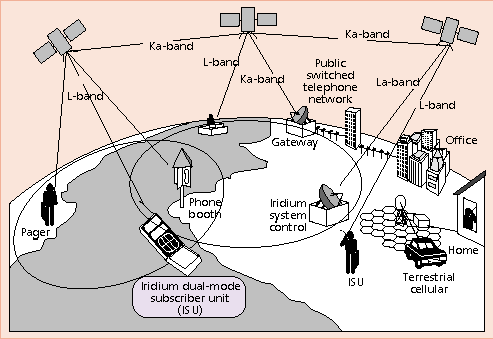
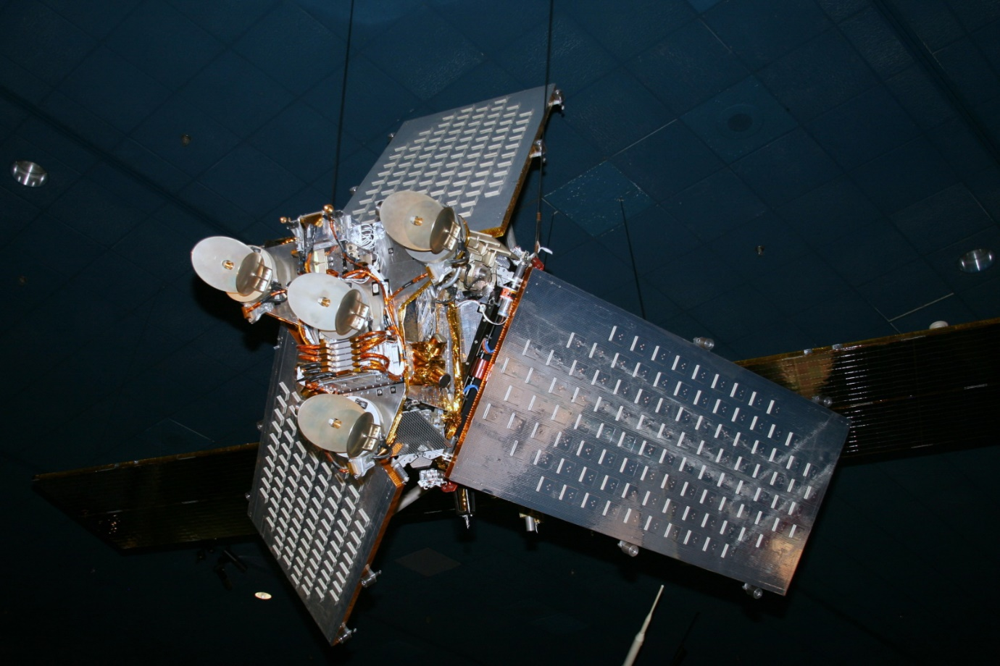
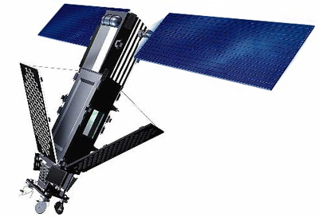
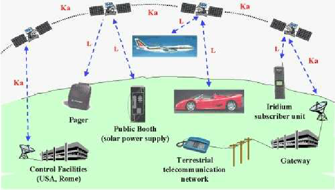
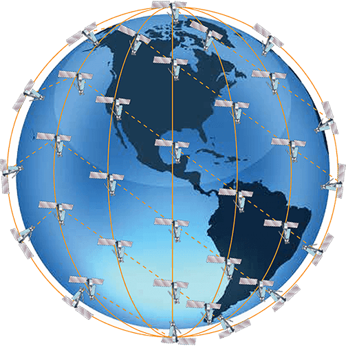

------------------------------------------------------------------------------------------------------------
# Iridium 

[Orbit](https://github.com/flyn28261/DuncanU/blob/main/Iridium/README.md#orbit)

[More Reading](https://github.com/flyn28261/DuncanU/blob/main/Iridium/README.md#more-reading)

[Videos](https://github.com/flyn28261/DuncanU/blob/main/Iridium/README.md#videos)

------------------------------------------------------------------------------------------------------------

The [Iridium satellite constellation](https://en.wikipedia.org/wiki/Iridium_satellite_constellation) provides L band voice and data information coverage to satellite phones, satellite messenger communication devices and integrated transceivers, as well as two-way satellite messaging service to supported Android smartphones, over the entire surface of Earth. [Iridium Communications](https://en.wikipedia.org/wiki/Iridium_Communications) owns and operates the constellation, additionally selling equipment and access to its services. It was conceived by Bary Bertiger, Raymond J. Leopold and Ken Peterson in late 1987 (in 1988 protected by patents [Motorola filed in their names](https://en.wikipedia.org/wiki/Motorola)) and then developed by Motorola on a fixed-price contract from July 29, 1993, to November 1, 1998, when the system became operational and commercially available.

The constellation consists of 66 active satellites in orbit, required for global coverage, and additional spare satellites to serve in case of failure. Satellites are placed in low Earth orbit at a height of approximately 781 kilometres (485 mi) and inclination of 86.4°. The nearly polar orbit and communication between satellites via [Ka band inter-satellite links](https://en.wikipedia.org/wiki/Inter-satellite_link) provide global service availability (including both poles, oceans and airways), regardless of the position of ground stations and gateways.

In 1999, [The New York Times](https://en.wikipedia.org/wiki/The_New_York_Times) quoted a wireless market analyst, regarding people having "one number that they could carry with them anywhere" as "expensive... There never was a viable market."

Due to the shape of the original Iridium satellites' reflective antennas, the first generation satellites focused sunlight on a small area of the Earth surface in an incidental manner. This resulted in a phenomenon called [Iridium flares](https://en.wikipedia.org/wiki/Satellite_flare), whereby the satellite momentarily appeared as one of the brightest objects in the night sky and could be seen even during daylight. Newer Iridium satellites do not produce flares.

The [Iridium system](https://en.wikipedia.org/wiki/Iridium_satellite_constellation) was designed to be accessed by small handheld phones, similar in size to a cell phone. While "the weight of a typical cell phone in the early 1990s was 10.5 ounces" (300 grams) [Advertising Age](https://en.wikipedia.org/wiki/Advertising_Age) wrote in mid 1999 that "when its phone debuted, weighing 1 pound (453 grams) and costing $3,000, it was viewed as both unwieldly and expensive."

An omnidirectional antenna was intended to be small enough to be mounted on the planned phone, but the low handset battery power was insufficient for contact with a satellite in geostationary orbit, 35,785 km (22,236 mi) above the Earth; the normal orbit of communications satellites, in which the satellite appears stationary in the sky. In order for a handheld phone to communicate with them, the [Iridium satellites](https://en.wikipedia.org/wiki/Iridium_satellite_constellation) are closer to the Earth, in low Earth orbit, about 781 km (485 mi) above the surface. With an orbital period of about 100 minutes a satellite can only be in view of a phone for about 7 minutes, so the call is automatically "handed off" to another satellite when one passes beyond the local horizon. This requires a large number of satellites, carefully spaced out in polar orbits ([see animated image of coverage](https://en.wikipedia.org/wiki/Iridium_satellite_constellation#/media/File:Iridium-Flare.ogv)) to ensure that at least one satellite is continually in view from every point on the Earth's surface. At least 66 satellites are required, in 6 polar orbits containing 11 satellites each, for seamless coverage.

## Orbit

Orbital velocity of the satellites is approximately 27,000 km/h (17,000 mph). Satellites communicate with neighboring satellites via [Ka band inter-satellite links](https://en.wikipedia.org/wiki/Inter-satellite_link). Each satellite can have four inter-satellite links: one each to neighbors fore and aft in the same orbital plane, and one each to satellites in neighboring planes to either side. The satellites orbit from pole to same pole with an orbital period of roughly 100 minutes. This design means that there is excellent satellite visibility and service coverage especially at the North and South poles. The over-the-pole orbital design produces "seams" where satellites in counter-rotating planes next to one another are traveling in opposite directions. Cross-seam inter-satellite link hand-offs would have to happen very rapidly and cope with large Doppler shifts; therefore, Iridium supports inter-satellite links only between satellites orbiting in the same direction. The constellation of 66 active satellites has six orbital planes spaced 30° apart, with 11 satellites in each plane (not counting spares). The original concept was to have 77 satellites, which is where the name Iridium came from; the element iridium has the atomic number 77, and the satellites evoked the Bohr model image of electrons orbiting around the Earth as its nucleus. This reduced set of six planes is sufficient to cover the entire Earth surface at every moment.

### More Reading

### Videos

[Iridium Milestone: Constellation Complete!](https://youtu.be/q2lVFvg69Fc?si=gqcxXBbwWmN5_wLp)
