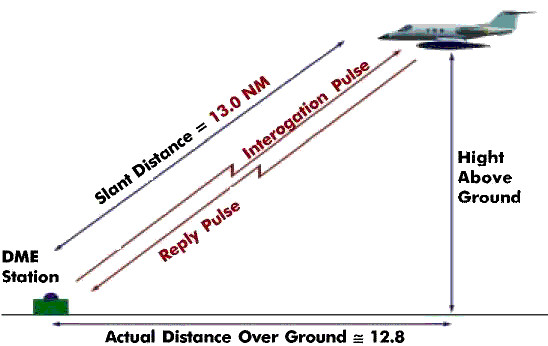
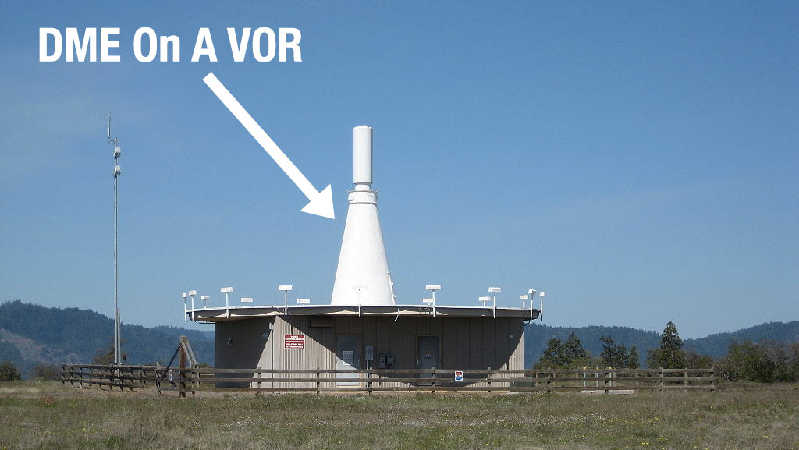

# DuncanU
DuncanU
This will be used as a location to house open source information to help teach new avionics techs.   

# Automatic direction finder 

An automatic direction finder (ADF) is a radio-navigation instrument that automatically and continuously displays the relative bearing from the aircraft to a suitable radio station. ADF receivers are normally tuned to aviation NDBs (Non-Directional Beacon) operating in the LW band between 190 – 535 kHz. Like RDF ([Radio Direction Finder](https://en.wikipedia.org/wiki/Direction_finding)) units, most ADF receivers can also receive medium wave (AM) broadcast stations, though these are less reliable for navigational purposes.

The operator tunes the ADF receiver to the correct frequency and verifies the identity of the beacon by listening to the Morse code signal transmitted by the NDB. On old ADF receivers used a motorized ferrite-bar antenna atop the unit (or remotely mounted) would rotate and lock when reaching the null of the desired station. See Loop Antenna on top of Amelia Earhart's Lockheed Model 10 Electra.

A bearing indicator on the antenna unit would movie atop a compass rose indicated in degrees the bearing of the station. On aviation ADFs, the unit automatically moves a compass-like pointer  to show the direction of the beacon. The pilot may use this pointer to home directly towards the beacon, or may also use the magnetic compass and calculate the direction from the beacon (the radial) at which their aircraft is located.

Unlike the RDF, the ADF operates without direct intervention, and continuously displays the direction of the tuned beacon. Initially, all ADF receivers contained a rotating loop or ferrite loopstick aerial driven by a motor which was controlled by the receiver. Like the RDF, a sense antenna verified the correct direction from its 180-degree opposite.

Modern aviation ADFs contain a small array of fixed aerials and use electronic sensors to deduce the direction using the strength and phase of the signals from each aerial. The electronic sensors listen for the trough that occurs when the antenna is at right angles to the signal, and provide the heading to the station using a direction indicator. In flight, the ADF's RMI or direction indicator will always point to the broadcast station regardless of aircraft heading. Dip error is introduced, however, when the aircraft is in a banked attitude, as the needle dips down in the direction of the turn. This is the result of the loop itself banking with the aircraft and therefore being at a different angle to the beacon. For ease of visualisation, it can be useful to consider a 90° banked turn, with the wings vertical. The bearing of the beacon as seen from the ADF aerial will now be unrelated to the direction of the aircraft to the beacon.

ADF receivers can be used to determine current position, track inbound and outbound flight path, and intercept a desired bearing. These procedures are also used to execute holding patterns and non-precision instrument approaches.

## More Reading
[Pilots Handbook of Aeronautical Knowledge](ADF/Pilots%Handbook%of%Aeronautical%Knowledge.pdf)

## Videos
[Understanding ADF](https://youtu.be/QQitucLrC8U?si=UZUXvmXRAXL9OD61)

# Distance Musering Equipment 

In aviation, distance measuring equipment (DME) is a radio navigation technology that measures the slant range (distance) between an aircraft and a ground station by timing the propagation delay of radio signals in the frequency band between 960 and 1215 megahertz (MHz). Line-of-visibility between the aircraft and ground station is required. An interrogator (airborne) initiates an exchange by transmitting a pulse pair, on an assigned 'channel', to the transponder ground station. The channel assignment specifies the carrier frequency and the spacing between the pulses. After a known delay, the transponder replies by transmitting a pulse pair on a frequency that is offset from the interrogation frequency by 63 MHz and having specified separation.

DME systems are used worldwide, using standards set by the International Civil Aviation Organization (ICAO), the European Union Aviation Safety Agency (EASA) and other bodies. 

While stand-alone DME transponders are permitted, DME transponders are usually paired with an azimuth guidance system to provide aircraft with a two-dimensional navigation capability. A common combination is a DME colocated with a VHF omnidirectional range (VOR) transmitter in a single ground station. When this occurs, the frequencies of the VOR and DME equipment are paired. Such a configuration enables an aircraft to determine its azimuth angle and distance from the station. 

ICAO characterizes DME transmissions as ultra high frequency (UHF). The term L-band is also used.

.[6][7] Owing to the generally superior accuracy of DME relative to VOR, navigation using two DMEs (using trilateration/distance) permits operations that navigating with VOR/DME (using azimuth/distance) does not. However, it requires that the aircraft have RNAV capabilities, and some operations also require an inertial reference unit.

## Distance calculation

A radio signal takes approximately 12.36 microseconds to travel 1 nautical mile (1,852 m) to the target and back. The time difference between interrogation and reply, minus the 50 microsecond ground transponder delay and the pulse width of the reply pulses (12 microseconds in X mode and 30 microseconds in Y mode), is measured by the interrogator's timing circuitry and converted to a distance measurement (slant range), in nautical miles, then displayed on the cockpit DME display.

The distance formula, distance = rate * time, is used by the DME receiver to calculate its distance from the DME ground station. The rate in the calculation is the velocity of the radio pulse, which is the speed of light (roughly 300,000,000 m/s or 186,000 mi/s). The time in the calculation is ½(total time − reply delay).

## Radio frequency and modulation data

DME frequencies are paired to VOR frequencies and a DME interrogator is designed to automatically tune to the corresponding DME frequency when the associated VOR frequency is selected. An airplane's DME interrogator uses frequencies from 1025 to 1150 MHz. DME transponders transmit on a channel in the 962 to 1213 MHz range and receive on a corresponding channel between 1025 and 1150 MHz. The band is divided into 126 channels for interrogation and 126 channels for reply. The interrogation and reply frequencies always differ by 63 MHz. The spacing of all channels is 1 MHz with a signal spectrum width of 100 kHz.

Technical references to X and Y channels relate only to the spacing of the individual pulses in the DME pulse pair, 12 microsecond spacing for X channels and 30 microsecond spacing for Y channels.

DME facilities identify themselves with a 1,350 Hz Morse code three letter identity. If collocated with a VOR or ILS, it will have the same identity code as the parent facility. Additionally, the DME will identify itself between those of the parent facility. The DME identity is 1,350 Hz to differentiate itself from the 1,020 Hz tone of the VOR or the ILS localizer.

## Frequency usage/channelization

DME frequency usage, channelization and pairing with other navaids (VOR, ILS, etc.) are defined by ICAO.[1] 252 DME channels are defined by the combination of their interrogation frequency, interrogation pulse spacing, reply frequency, and reply pulse spacing. These channels are labeled 1X, 1Y, 2X, 2Y, ... 126X, 126Y. X channels (which came first) have both interrogation and reply pulse pairs spaced by 12 microseconds. Y channels (which were added to increase capacity) have interrogation pulse pairs spaced by 36 microseconds and reply pulse pairs spaced by 30 microseconds.

A total of 252 frequencies are defined (but not all used) for DME interrogations and replies—specifically, 962, 963, ... 1213 megahertz. Interrogation frequencies are 1025, 1026, ... 1150 megahertz (126 total), and are the same for X and Y channels. For a given channel, the reply frequency is 63 megahertz below or above the interrogation frequency. The reply frequency is different for X and Y channels, and different for channels numbered 1-63 and 64-126.

Not all defined channels/frequencies are assigned. There are assignment 'holes' centered on 1030 and 1090 megahertz to provide protection for the secondary surveillance radar (SSR) system. In many countries, there is also an assignment 'hole' centered on 1176.45 megahertz to protect the GPS L5 frequency. These three 'holes' remove approximately 60 megahertz from the frequencies available for use.

Precision DME (DME/P), a component of the Microwave Landing System, is assigned to Z channels, which have a third set of interrogation and reply pulse spacings. The Z channels are multiplexed with the Y channels and do not materially affect the channel plan.

## More Reading

## Videos
[Distance Measuring Equipment](https://youtu.be/wMmooAYr9sw?si=bqWSsvgKMyMLXZvk)
[DME](https://youtu.be/CEpoCVGk1UQ?si=HjiNIj6QVjT1fCE7)
