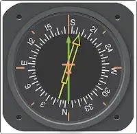
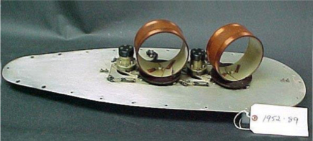
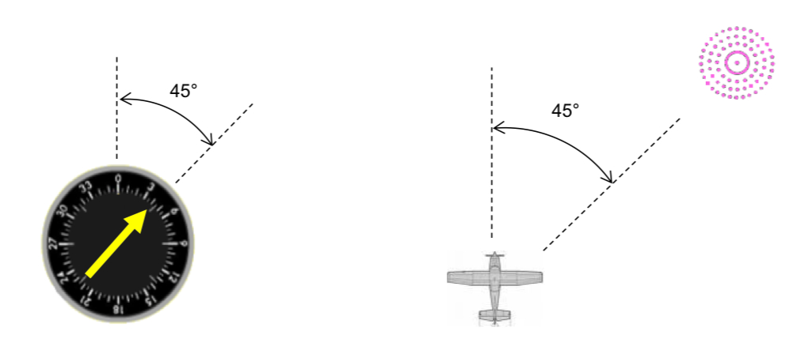

# DuncanU
DuncanU
This will be used as a location to house open source information to help teach new avionics techs.   

## Automatic direction finder 

An automatic direction finder (ADF) is a radio-navigation instrument that automatically and continuously displays the relative bearing from the aircraft to a suitable radio station. ADF receivers are normally tuned to aviation NDBs (Non-Directional Beacon) operating in the LW band between 190 – 535 kHz. Like RDF ([Radio Direction Finder](https://en.wikipedia.org/wiki/Direction_finding)) units, most ADF receivers can also receive medium wave (AM) broadcast stations, though these are less reliable for navigational purposes.

The operator tunes the ADF receiver to the correct frequency and verifies the identity of the beacon by listening to the Morse code signal transmitted by the NDB. On old ADF receivers used a motorized ferrite-bar antenna atop the unit (or remotely mounted) would rotate and lock when reaching the null of the desired station. See Loop Antenna on top of Amelia Earhart's Lockheed Model 10 Electra.

A bearing indicator on the antenna unit would movie atop a compass rose indicated in degrees the bearing of the station. On aviation ADFs, the unit automatically moves a compass-like pointer  to show the direction of the beacon. The pilot may use this pointer to home directly towards the beacon, or may also use the magnetic compass and calculate the direction from the beacon (the radial) at which their aircraft is located.

Unlike the RDF, the ADF operates without direct intervention, and continuously displays the direction of the tuned beacon. Initially, all ADF receivers contained a rotating loop or ferrite loopstick aerial driven by a motor which was controlled by the receiver. Like the RDF, a sense antenna verified the correct direction from its 180-degree opposite.

Modern aviation ADFs contain a small array of fixed aerials and use electronic sensors to deduce the direction using the strength and phase of the signals from each aerial. The electronic sensors listen for the trough that occurs when the antenna is at right angles to the signal, and provide the heading to the station using a direction indicator. In flight, the ADF's RMI or direction indicator will always point to the broadcast station regardless of aircraft heading. Dip error is introduced, however, when the aircraft is in a banked attitude, as the needle dips down in the direction of the turn. This is the result of the loop itself banking with the aircraft and therefore being at a different angle to the beacon. For ease of visualisation, it can be useful to consider a 90° banked turn, with the wings vertical. The bearing of the beacon as seen from the ADF aerial will now be unrelated to the direction of the aircraft to the beacon.

ADF receivers can be used to determine current position, track inbound and outbound flight path, and intercept a desired bearing. These procedures are also used to execute holding patterns and non-precision instrument approaches.
