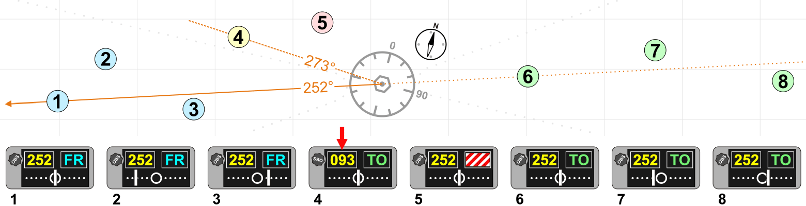

# DuncanU
DuncanU
This will be used as a location to house open source information to help teach new avionics techs.   

# Automatic direction finder 
------------------------------------------------------------------------------------------------------------

An automatic direction finder (ADF) is a radio-navigation instrument that automatically and continuously displays the relative bearing from the aircraft to a suitable radio station. ADF receivers are normally tuned to aviation NDBs (Non-Directional Beacon) operating in the LW band between 190 – 535 kHz. Like RDF ([Radio Direction Finder](https://en.wikipedia.org/wiki/Direction_finding)) units, most ADF receivers can also receive medium wave (AM) broadcast stations, though these are less reliable for navigational purposes.

The operator tunes the ADF receiver to the correct frequency and verifies the identity of the beacon by listening to the Morse code signal transmitted by the NDB. On old ADF receivers used a motorized ferrite-bar antenna atop the unit (or remotely mounted) would rotate and lock when reaching the null of the desired station. See Loop Antenna on top of Amelia Earhart's Lockheed Model 10 Electra.

A bearing indicator on the antenna unit would movie atop a compass rose indicated in degrees the bearing of the station. On aviation ADFs, the unit automatically moves a compass-like pointer to show the direction of the beacon. The pilot may use this pointer to home directly towards the beacon, or may also use the magnetic compass and calculate the direction from the beacon (the radial) at which their aircraft is located.

Unlike the RDF, the ADF operates without direct intervention, and continuously displays the direction of the tuned beacon. Initially, all ADF receivers contained a rotating loop or ferrite loopstick aerial driven by a motor which was controlled by the receiver. Like the RDF, a sense antenna verified the correct direction from its 180-degree opposite.

Modern aviation ADFs contain a small array of fixed aerials and use electronic sensors to deduce the direction using the strength and phase of the signals from each aerial. The electronic sensors listen for the trough that occurs when the antenna is at right angles to the signal, and provide the heading to the station using a direction indicator. In flight, the ADF's RMI or direction indicator will always point to the broadcast station regardless of aircraft heading. Dip error is introduced, however, when the aircraft is in a banked attitude, as the needle dips down in the direction of the turn. This is the result of the loop itself banking with the aircraft and therefore being at a different angle to the beacon. For ease of visualisation, it can be useful to consider a 90° banked turn, with the wings vertical. The bearing of the beacon as seen from the ADF aerial will now be unrelated to the direction of the aircraft to the beacon.

ADF receivers can be used to determine current position, track inbound and outbound flight path, and intercept a desired bearing. These procedures are also used to execute holding patterns and non-precision instrument approaches.

### More Reading
[Pilots Handbook of Aeronautical Knowledge](ADF/Pilots%Handbook%of%Aeronautical%Knowledge.pdf)

### Videos
[Understanding ADF](https://youtu.be/QQitucLrC8U?si=UZUXvmXRAXL9OD61)

-----------------------------------------------------------------------------------------------------------
# Distance Musering Equipment 
------------------------------------------------------------------------------------------------------------

In aviation, distance measuring equipment (DME) is a radio navigation technology that measures the slant range (distance) between an aircraft and a ground station by timing the propagation delay of radio signals in the frequency band between 960 and 1215 megahertz (MHz). Line-of-visibility between the aircraft and ground station is required. An interrogator (airborne) initiates an exchange by transmitting a pulse pair, on an assigned 'channel', to the transponder ground station. The channel assignment specifies the carrier frequency and the spacing between the pulses. After a known delay, the transponder replies by transmitting a pulse pair on a frequency that is offset from the interrogation frequency by 63 MHz and having specified separation.

DME systems are used worldwide, using standards set by the International Civil Aviation Organization (ICAO), the European Union Aviation Safety Agency (EASA) and other bodies. 

While stand-alone DME transponders are permitted, DME transponders are usually paired with an azimuth guidance system to provide aircraft with a two-dimensional navigation capability. A common combination is a DME colocated with a VHF omnidirectional range (VOR) transmitter in a single ground station. When this occurs, the frequencies of the VOR and DME equipment are paired. Such a configuration enables an aircraft to determine its azimuth angle and distance from the station. 

ICAO characterizes DME transmissions as ultra high frequency (UHF). The term L-band is also used.

## Operation

In its first iteration, a DME-equipped airplane used the equipment to determine and display its distance from a land-based transponder by sending and receiving pulse pairs. The ground stations are typically collocated with VORs or VORTACs. 

A newer role for DMEs is DME/DME area navigation (RNAV).[6][7] Owing to the generally superior accuracy of DME relative to VOR, navigation using two DMEs (using trilateration/distance) permits operations that navigating with VOR/DME (using azimuth/distance) does not. However, it requires that the aircraft have RNAV capabilities, and some operations also require an inertial reference unit.

## Distance calculation

A radio signal takes approximately 12.36 microseconds to travel 1 nautical mile (1,852 m) to the target and back. The time difference between interrogation and reply, minus the 50 microsecond ground transponder delay and the pulse width of the reply pulses (12 microseconds in X mode and 30 microseconds in Y mode), is measured by the interrogator's timing circuitry and converted to a distance measurement (slant range), in nautical miles, then displayed on the cockpit DME display.

The distance formula, distance = rate * time, is used by the DME receiver to calculate its distance from the DME ground station. The rate in the calculation is the velocity of the radio pulse, which is the speed of light (roughly 300,000,000 m/s or 186,000 mi/s). The time in the calculation is ½(total time − reply delay).

## Radio frequency and modulation data

DME frequencies are paired to VOR frequencies and a DME interrogator is designed to automatically tune to the corresponding DME frequency when the associated VOR frequency is selected. An airplane's DME interrogator uses frequencies from 1025 to 1150 MHz. DME transponders transmit on a channel in the 962 to 1213 MHz range and receive on a corresponding channel between 1025 and 1150 MHz. The band is divided into 126 channels for interrogation and 126 channels for reply. The interrogation and reply frequencies always differ by 63 MHz. The spacing of all channels is 1 MHz with a signal spectrum width of 100 kHz.

Technical references to X and Y channels relate only to the spacing of the individual pulses in the DME pulse pair, 12 microsecond spacing for X channels and 30 microsecond spacing for Y channels.

DME facilities identify themselves with a 1,350 Hz Morse code three letter identity. If collocated with a VOR or ILS, it will have the same identity code as the parent facility. Additionally, the DME will identify itself between those of the parent facility. The DME identity is 1,350 Hz to differentiate itself from the 1,020 Hz tone of the VOR or the ILS localizer.

## Frequency usage/channelization

DME frequency usage, channelization and pairing with other navaids (VOR, ILS, etc.) are defined by ICAO. 252 DME channels are defined by the combination of their interrogation frequency, interrogation pulse spacing, reply frequency, and reply pulse spacing. These channels are labeled 1X, 1Y, 2X, 2Y, ... 126X, 126Y. X channels (which came first) have both interrogation and reply pulse pairs spaced by 12 microseconds. Y channels (which were added to increase capacity) have interrogation pulse pairs spaced by 36 microseconds and reply pulse pairs spaced by 30 microseconds.

A total of 252 frequencies are defined (but not all used) for DME interrogations and replies—specifically, 962, 963, ... 1213 megahertz. Interrogation frequencies are 1025, 1026, ... 1150 megahertz (126 total), and are the same for X and Y channels. For a given channel, the reply frequency is 63 megahertz below or above the interrogation frequency. The reply frequency is different for X and Y channels, and different for channels numbered 1-63 and 64-126.

Not all defined channels/frequencies are assigned. There are assignment 'holes' centered on 1030 and 1090 megahertz to provide protection for the secondary surveillance radar (SSR) system. In many countries, there is also an assignment 'hole' centered on 1176.45 megahertz to protect the GPS L5 frequency. These three 'holes' remove approximately 60 megahertz from the frequencies available for use.

Precision DME (DME/P), a component of the Microwave Landing System, is assigned to Z channels, which have a third set of interrogation and reply pulse spacings. The Z channels are multiplexed with the Y channels and do not materially affect the channel plan.

### More Reading

### Videos
[Distance Measuring Equipment](https://youtu.be/wMmooAYr9sw?si=bqWSsvgKMyMLXZvk)

[DME](https://youtu.be/CEpoCVGk1UQ?si=HjiNIj6QVjT1fCE7)

-----------------------------------------------------------------------------------------------------------
# Compass
-----------------------------------------------------------------------------------------------------------

## Magnetic Compass 

The magnetic compass is a direction finding instrument that has been used for navigation for hundreds of years. It is a simple instrument that takes advantage of the earth’s magnetic field.

The magnetic north pole is very close to the geographic North Pole of the globe, but they are not the same. An ordinary permanent magnet that is free to do so, aligns itself with the direction of the earth’s magnetic field. Upon this principle, an instrument is constructed that the pilot can reference for directional orientation. Permanent magnets are attached under a float that is mounted on a pivot so it is free to rotate in the horizontal plane. As such, the magnets align with the earth’s magnetic field. A numerical compass card, usually graduated in 5° increments, is constructed around the perimeter of the float. It serves as the instrument dial.

The entire assembly is enclosed in a sealed case that is filled with a liquid similar to kerosene. This dampens vibration and oscillation of the moving float assembly and decreases friction.

There are accuracy issues associated with using a magnetic compass. The main magnets of a compass align not only with the earth’s magnetic field, they actually align with the composite field made up of all magnetic influences around them, meaning local electromagnetic influence from metallic structures near the compass and operation of the aircraft’s electrical system. This is called magnetic deviation. It causes a magnet’s alignment with the earth’s magnetic field to be altered. Compensating screws are turned, which move small permanent magnets in the compass case to correct for this

magnetic deviation. The two set-screws are on the face of the instrument and are labeled N-S and E-W. They position the small magnets to counterbalance the local magnetic influences acting on the main compass magnets.

The process for knowing how to adjust for deviation is known as swinging the compass. 

## Remote Indicating Slaved Gyro Compass (Flux Gate Compass)

An elaborate and very accurate method of direction indication has been developed that combines the use of a gyro, a magnetic compass, and a remote indicating system.  It is called the slaved gyro compass or flux gate compass system. 

A gyroscopic direction indicator is augmented by magnetic direction information from a remotely located compass. The type of compass used is called a flux valve or flux gate compass. It consists of a very magnetically permeable circular segmented core frame or spider. The earth’s magnetic field flows through this iron core and varies its distribution through segments of the core as the flux valve is rotated via the movement of the aircraft. Pickup coil windings are located on each of the core’s spider legs that are positioned 120° apart.

The distribution of earth’s magnetic field flowing through the legs is unique for every directional orientation of the aircraft. A coil is placed in the center of the core and is energized by AC current. As the AC flow passes through zero while changing direction, the earth’s magnetic field is allowed to flow through the core. Then, it is blocked or gated as the magnetic field of the core current flow builds to its peak again. The cycle is repeated at the frequency of the AC supplied to the excitation coil. The result is repeated flow and nonflow of the earth’s flux across the pickup coils. During each cycle, a unique voltage is induced in each of the pickup coils reflecting the orientation of the aircraft in the earth’s magnetic field.

The electricity that flows from each of the pickup coils is transmitted out of the flux valve via wires into a second unit. It contains an autosyn transmitter, directional gyro, an amplifier, and a triple wound stator that is similar to that found in the indicator of a synchro system. Unique voltage is induced in the center rotor of this stator which reflects the voltage received from the flux valve pickup coils sent through the stator coils. It is amplified and used to augment the position of the DG. The gyro is wired to be the rotor of an autosyn synchro system, which transmits the position of the gyro into an indicator unit located in the cockpit. In the indicator, a vertical compass card is rotated against a small airplane type lubber line like that in a vertical magnetic compass.

## Solid State Magnetometers

Solid state magnetometers are used on many modern aircraft. They have no moving parts and are extremely accurate. Tiny layered structures react to magnetism on a molecular level resulting in variations in electron activity. These low power consuming devices can sense not only the direction to the earth’s magnetic poles, but also the angle of the flux field. They are free from oscillation that plagues a standard magnetic compass. They feature integrated processing algorithms and easy integration with digital systems. 
 

### More Reading

### Videos

[Heading Indicator (Directional Gyro)](https://youtu.be/q1TVR9xdl64?si=ubQ4j7hgkn6LtXO9)
[Gyro Magnetic Compass Flux Valve](https://youtu.be/nRz3fbaIxxQ?si=SYe-jsu7AIsZ8beH)

-----------------------------------------------------------------------------------------------------------
# VHF Omnidirectional Range (VOR)

------------------------------------------------------------------------------------------------------------

Very High Frequency Omnirange Station (VOR) is a type of short-range radio navigation system for aircraft, enabling aircraft with a receiving unit to determine its position and stay on course by receiving radio signals transmitted by a network of fixed ground radio beacons. It uses frequencies in the very high frequency (VHF) band from 108.00 to 117.95 MHz. Developed in the United States beginning in 1937 and deployed by 1946, VOR became the standard air navigational system in the world, used by both commercial and general aviation, until supplanted by satellite navigation systems such as GPS in the early 21st century. As such, VOR stations are being gradually decommissioned. In 2000 there were about 3,000 VOR stations operating around the world, including 1,033 in the US, but by 2013 the number in the US had been reduced to 967. The United States is decommissioning approximately half of its VOR stations and other legacy navigation aids as part of a move to performance-based navigation, while still retaining a "Minimum Operational Network" of VOR stations as a backup to GPS.

A VOR ground station uses a specialized antenna system to transmit both an amplitude modulated and a frequency modulated signal. Both modulations are done with a 30 Hz signal, but the phase is different. The phase of one of the modulation signals is dependent on the direction of transmission, while the phase of the other modulation signal is not, in order to serve as a reference. The receiver will demodulate both signals, and measure the phase difference. The phase difference is indicative of the bearing from the VOR station to the receiver relative to magnetic north. This line of position is called the VOR "radial".

The intersection of radials from two different VOR stations can be used to fix the position of the aircraft, as in earlier radio direction finding (RDF) systems.

VOR stations are fairly short range: the signals are line-of-sight between transmitter and receiver and are useful for up to 200 nautical miles (370 kilometres). Each station broadcasts a VHF radio composite signal including the mentioned navigation and reference signal, station's identifier and voice, if so equipped. The station's identifier is typically a three-letter string in Morse code. The voice signal, if used, is usually the station name, in-flight recorded advisories, or live flight service broadcasts.

A VORTAC is a radio-based navigational aid for aircraft pilots consisting of a co-located VHF omnidirectional range and a tactical air navigation system (TACAN) beacon. Both types of beacons provide pilots azimuth information, but the VOR system is generally used by civil aircraft and the TACAN system by military aircraft. However, the TACAN distance measuring equipment is also used for civil purposes because civil DME equipment is built to match the military DME specifications. Most VOR installations in the United States are VORTACs. The system was designed and developed by the Cardion Corporation. The Research, Development, Test, and Evaluation (RDT&E) contract was awarded 28 December 1981.

## Operation

VORs are assigned radio channels between 108.0 MHz and 117.95 MHz (with 50 kHz spacing); this is in the very high frequency (VHF) range. The first 4 MHz is shared with the instrument landing system (ILS) band. In the United States, frequencies within the pass band of 108.00 to 111.95 MHz which have an even 100 kHz first digit after the decimal point (108.00, 108.05, 108.20, 108.25, and so on) are reserved for VOR frequencies while frequencies within the 108.00 to 111.95 MHz pass band with an odd 100 kHz first digit after the decimal point (108.10, 108.15, 108.30, 108.35, and so on) are reserved for ILS.

The VOR encodes azimuth (direction from the station) as the phase relationship between a reference signal and a variable signal. One of them is amplitude modulated, and one is frequency modulated. On conventional VORs (CVOR), the 30 Hz reference signal is frequency modulated (FM) on a 9,960 Hz subcarrier. Modern VORs use a circular array of typically 48 omni-directional antennas and no moving parts. The active antenna is moved around the circular array electronically to create a doppler effect, resulting in frequency modulation. The amplitude modulation is created by making the transmission power of antennas at e.g. the north position lower than at the south position. The role of amplitude and frequency modulation is thus swapped in this type of VOR. Decoding in the receiving aircraft happens in the same way for both types of VORs: the AM and FM 30 Hz components are detected and then compared to determine the phase angle between them.

The VOR signal also contains a modulated continuous wave (MCW) 7 wpm Morse code station identifier, and usually contains an amplitude modulated (AM) voice channel.

This information is then fed over an analog or digital interface to one of four common types of indicators:

A typical light-airplane VOR indicator, sometimes called an "omni-bearing indicator" or OBI is shown in the illustration at the top of this entry. It consists of a knob to rotate an "Omni Bearing Selector" (OBS), the OBS scale around the outside of the instrument, and a vertical course deviation indicator or (CDI) pointer. The OBS is used to set the desired course, and the CDI is centred when the aircraft is on the selected course, or gives left/right steering commands to return to the course. An "ambiguity" (TO-FROM) indicator shows whether following the selected course would take the aircraft to, or away from the station. The indicator may also include a glideslope pointer for use when receiving full ILS signals.

A radio magnetic indicator (RMI) features a course arrow superimposed on a rotating card that shows the aircraft's current heading at the top of the dial. The "tail" of the course arrow points at the current radial from the station and the "head" of the arrow points at the reciprocal (180° different) course to the station. An RMI may present information from more than one VOR or ADF receiver simultaneously.

A horizontal situation indicator (HSI), developed subsequently to the RMI, is considerably more expensive and complex than a standard VOR indicator but combines heading information with the navigation display in a much more user-friendly format, approximating a simplified moving map.

An area navigation (RNAV) system is an onboard computer with display and may include an up-to-date navigation database. At least one VOR/DME station is required for the computer to plot aircraft position on a moving map or to display course deviation and distance relative to a waypoint (virtual VOR station). RNAV type systems have also been made to use two VORs or two DMEs to define a waypoint; these are typically referred to by other names such as "distance computing equipment" for the dual-VOR type or "DME-DME" for the type using more than one DME signal.

While the operating principles are different, VORs share some characteristics with the localizer portion of ILS and the same antenna, receiving equipment and indicator is used in the cockpit for both. When a VOR station is selected, the OBS is functional and allows the pilot to select the desired radial to use for navigation. When a localizer frequency is selected, the OBS is not functional and the indicator is driven by a localizer converter, typically built into the receiver or indicator.

## Testing
Before using a VOR indicator for the first time, it can be tested and calibrated at an airport with a VOR test facility, or VOT. A VOT differs from a VOR in that it replaces the variable directional signal with another omnidirectional signal, in a sense transmitting a 360° radial in all directions. The NAV receiver is tuned to the VOT frequency, then the OBS is rotated until the needle is centred. If the indicator reads within four degrees of 000 with the FROM flag visible or 180 with the TO flag visible, it is considered usable for navigation. The FAA requires testing and calibration of a VOR indicator no more than 30 days before any flight under IFR.

### More Reading

### Videos

[VOR](https://youtu.be/KRSaSNeymNo?si=vSwxBAN2Q-JxOhm-)

-----------------------------------------------------------------------------------------------------------
# Transponder
-----------------------------------------------------------------------------------------------------------

### More Reading

### Videos

[Primary and Secondary Surveillance Radar](https://youtu.be/i4fIHHGp2zU?si=leMDIU0hTsa9VtfD)
[Secondary Surveillance Radar: Mode S](https://youtu.be/M_C2R4U-xug?si=v3dzMByYM6NHMz1-)

-----------------------------------------------------------------------------------------------------------

# TCAS
-----------------------------------------------------------------------------------------------------------

### More Reading

### Videos

-----------------------------------------------------------------------------------------------------------
# ILS
-----------------------------------------------------------------------------------------------------------
### More Reading

### Videos

[Instrument Landing System](https://youtu.be/avOHOL2bmGI?si=5ogSTTGNBONCaltG)

-----------------------------------------------------------------------------------------------------------
# INS
-----------------------------------------------------------------------------------------------------------
### More Reading

### Videos

[Inertial Naviagtion](https://youtu.be/kqRJGolOLec?si=8HN6uAGn9jjXeuMJ)

-----------------------------------------------------------------------------------------------------------
# AHRS
-----------------------------------------------------------------------------------------------------------
### More Reading

### Videos
-----------------------------------------------------------------------------------------------------------
# FMS
-----------------------------------------------------------------------------------------------------------
## GPS 

### More Reading

### Videos

[How GPS Works, And How It Got Better Than The Designers Ever Imagined](https://youtu.be/qJ7ZAUjsycY?si=m5zHfkj7PmRT8Kdr)
[GPS Localization and Navigation Message](https://youtu.be/UFIWAEKHyGY?si=KtbQ7E1wqgPEoLD9)
[GPS Signals](https://youtu.be/yK1Q6fN6Q7g?si=bsCBRrTxbkNaLiHG)

-----------------------------------------------------------------------------------------------------------
# Radar Altimeter
-----------------------------------------------------------------------------------------------------------
### More Reading

### Videos

############################################################################################################
# VHF COMM
-----------------------------------------------------------------------------------------------------------
### More Reading

### Videos

-----------------------------------------------------------------------------------------------------------
# HF Comm
-----------------------------------------------------------------------------------------------------------

## Selcal

### More Reading

### Videos

-----------------------------------------------------------------------------------------------------------
# ELT 
-----------------------------------------------------------------------------------------------------------
### More Reading

### Videos

-----------------------------------------------------------------------------------------------------------
# Satcom
-----------------------------------------------------------------------------------------------------------
### More Reading

### Videos

------------------------------------------------------------------------------------------------------

# GO GO
-----------------------------------------------------------------------------------------------------------
### More Reading

### Videos

-----------------------------------------------------------------------------------------------------------
# KA KU
-----------------------------------------------------------------------------------------------------------
### More Reading

### Videos
-----------------------------------------------------------------------------------------------------------
# Iriduum
-----------------------------------------------------------------------------------------------------------
### More Reading

### Videos

------------------------------------------------------------------------------------

# Attitude Indicator
-----------------------------------------------------------------------------------------------------------
### More Reading

### Videos

-----------------------------------------------------------------------------------------------------------
# Autopilot
-----------------------------------------------------------------------------------------------------------
### More Reading

### Videos

-----------------------------------------------------------------------------------------------------------
# CMC
-----------------------------------------------------------------------------------------------------------
### More Reading

### Videos

-----------------------------------------------------------------------------------------------------------
# EGPWS
-----------------------------------------------------------------------------------------------------------
### More Reading

### Videos

-----------------------------------------------------------------------------------------------------------
# Pitot Static
-----------------------------------------------------------------------------------------------------------
### More Reading

### Videos

-----------------------------------------------------------------------------------------------------------
# Sat Tas
-----------------------------------------------------------------------------------------------------------
### More Reading

### Videos

-----------------------------------------------------------------------------------------------------------
# VSI
-----------------------------------------------------------------------------------------------------------
### More Reading

### Videos

-----------------------------------------------------------------------------------------------------------
# FAR-CFR
-----------------------------------------------------------------------------------------------------------
### More Reading

### Videos

