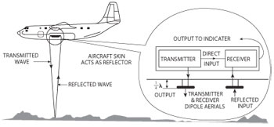

------------------------------------------------------------------------------------------------------------
# Radar Altimeter 

[More Reading](https://github.com/flyn28261/DuncanU/tree/main/Radar%20Altimeter#more-reading)

[Videos](https://github.com/flyn28261/DuncanU/tree/main/Radar%20Altimeter#videos)

------------------------------------------------------------------------------------------------------------

A [radio altimeter](https://en.wikipedia.org/wiki/Radio_altimeter), also known as a radar altimeter, is employed to gauge the distance between the aircraft and the ground directly beneath it. It is predominantly utilized during instrument approaches and in situations of low-level or nighttime flying below 2500 feet. This device furnishes the principal altitude data for determining the height at which a landing should be initiated. It features an adjustable altitude marker that triggers a visual or audible alert to the pilot once the aircraft reaches that specific altitude. Typically, if the decision height is reached and the runway is not visible, the pilot will opt to abort the landing.

Using a [transceiver](https://en.wikipedia.org/wiki/Transceiver) and a directional [antenna](https://en.wikipedia.org/wiki/Antenna), the radio altimeter emits a carrier wave at 4.3 GHz from the aircraft directly towards the ground. This wave undergoes frequency modulation at 50 MHz and moves at a known velocity. Upon striking surface features, it reflects back towards the aircraft, where a second antenna captures the return signal. The transceiver processes the signal by calculating the time taken for the signal to travel and the frequency modulation it underwent. The display shows the height above the terrain, also referred to as above ground level (AGL).

In comparison to an air pressure altimeter, a radar altimeter provides more precise and immediate information about altitude above ground level (AGL) at lower elevations. The transceiver is typically situated in a location separate from the indicator. Modern multifunctional and glass cockpit displays often incorporate awareness of decision height from the radar altimeter as a digital value displayed on the screen, along with an indicator, light, or color change to signify when that altitude is reached. In larger aircraft, information from the radio altimeter may be integrated into a [Ground Proximity Warning System (GPWS)](https://en.wikipedia.org/wiki/Ground_proximity_warning_system) that audibly notifies the crew of potentially hazardous proximity to the terrain beneath the aircraft. A Decision Height window (DH) displays the radar altitude on the Electronic Attitude Director Indicator (EADI).

## More Reading

[Radar Altimeter Overview of Design and Performance](https://github.com/flyn28261/DuncanU/blob/main/Radar%20Altimeter/Radar-Altimeter-Overview-of-Design-and-Performance.pdf)

## Videos

[How a Radio Altimeter Work](https://youtu.be/CGSK8wUJRqQ?si=VmdcOA1hC5fxlrPv)
