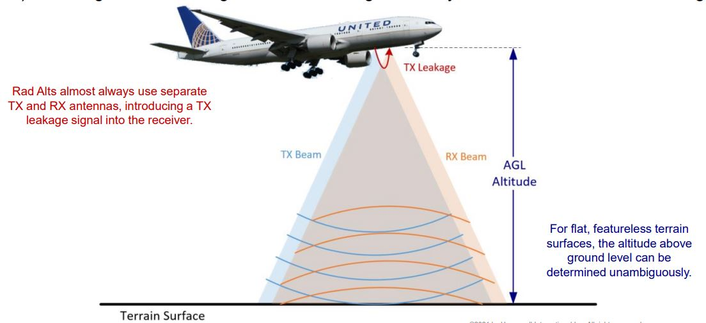

------------------------------------------------------------------------------------------------------------
# Radar Altimeter 

[More Reading](https://github.com/flyn28261/DuncanU/tree/main/Radar%20Altimeter#more-reading)

[Videos](https://github.com/flyn28261/DuncanU/tree/main/Radar%20Altimeter#videos)

------------------------------------------------------------------------------------------------------------

A **Radar Altimeter**, also known as a Radio Altimeter, is a type of altimeter used in aircraft to measure the height above the terrain or water directly beneath the aircraft. It does so by emitting radio waves and measuring the time it takes for the waves to bounce off the ground and return to the aircraft. Here's how a Radar Altimeter works:

1. **Transmitter and Antenna**:
   - The radar altimeter system includes a transmitter and an antenna located on the underside of the aircraft.
   - The transmitter generates short pulses of radio frequency (RF) energy.

2. **Emission of Radio Waves**:
   - The transmitter emits radio waves, which travel downwards towards the ground.

3. **Reflection from Surface**:
   - When the radio waves encounter the surface (terrain, water, etc.), they are reflected back towards the aircraft.

4. **Receiver and Signal Processing**:
   - The receiver in the radar altimeter system is designed to detect the reflected radio waves.
   - It measures the time interval between the transmission and reception of the signal.

5. **Distance Calculation**:
   - Using the known speed of light, the system calculates the distance between the aircraft and the reflecting surface by multiplying the round-trip time by the speed of light and dividing by two.

6. **Altitude Display**:
   - The calculated distance is then displayed to the pilot in the cockpit as the altitude above the terrain directly beneath the aircraft.

7. **Continuous Updates**:
   - The radar altimeter provides continuous updates of the aircraft's altitude above the terrain, allowing the pilot to monitor changes in terrain elevation during flight.

It's important to note that radar altimeters are primarily used for low-level flight, especially during approach and landing phases of flight. They are crucial for providing accurate altitude information when the aircraft is close to the ground and in conditions where visual references may be limited, such as during low visibility or when flying over uneven terrain.

Radar altimeters complement other altitude measurement systems, such as the barometric altimeter, which provides altitude above sea level. Together, these instruments help pilots maintain safe altitudes during various phases of flight.

## More Reading

[Radar-Altimeter-Overview-of-Design-and-Performance](Radar Altimeter/Radar-Altimeter-Overview-of-Design-and-Performance.pdf)

## Videos

[How a Radio Altimeter Work](https://youtu.be/CGSK8wUJRqQ?si=VmdcOA1hC5fxlrPv)
