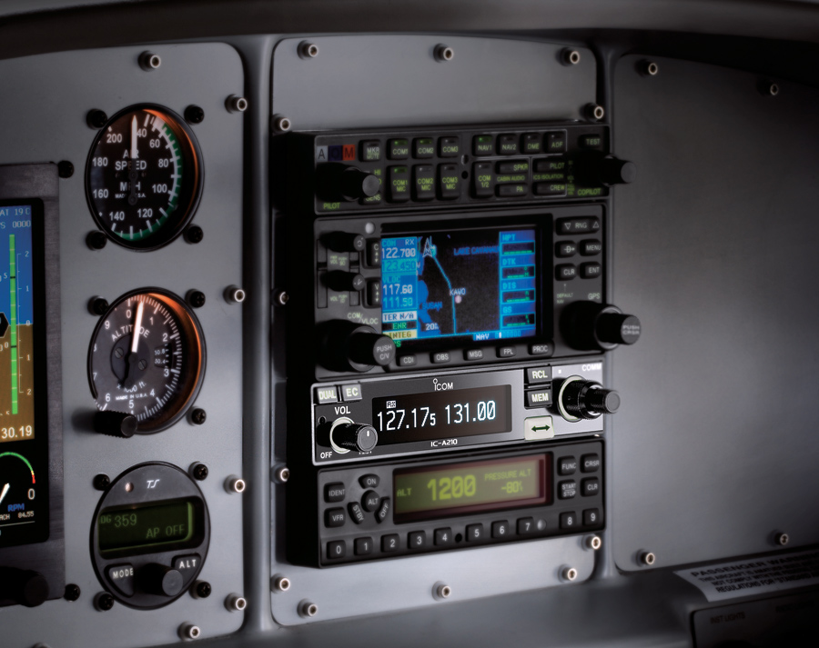
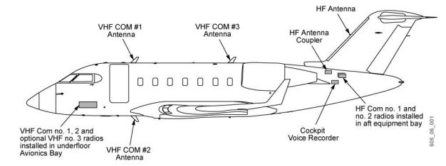
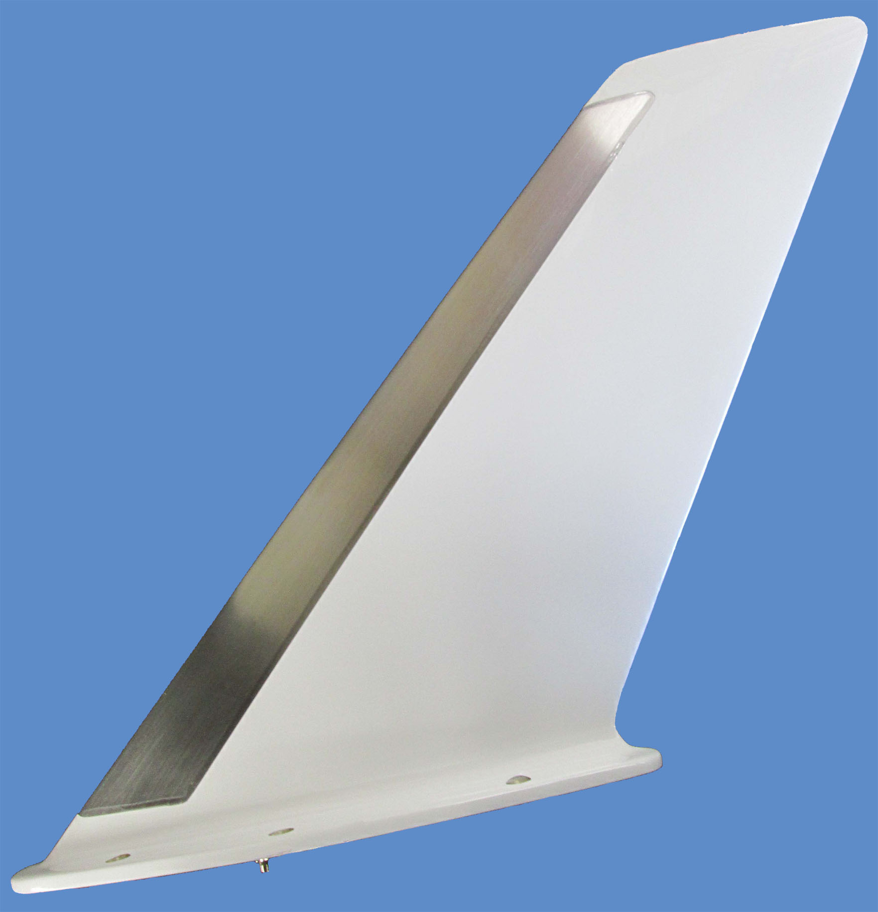

------------------------------------------------------------------------------------------------------------
# VHF COMM 

[More Reading](https://github.com/flyn28261/DuncanU/tree/main/VHF%20COMM#more-reading)

[Videos](https://github.com/flyn28261/DuncanU/tree/main/VHF%20COMM#more-reading)

------------------------------------------------------------------------------------------------------------

A **VHF Communication (Com) System** in an aircraft allows for voice communication between the aircraft and ground stations or other aircraft using [Very High Frequency (VHF)](https://en.wikipedia.org/wiki/Very_high_frequency) radio waves. Here's how a VHF Com system works:

1. **Microphone and Audio System**:
   - The system begins with a microphone in the cockpit, which converts the pilot's voice into an electrical audio signal.

2. **Audio Amplification and Processing**:
   - The audio signal is then amplified and processed to ensure clarity and quality.

3. **Modulation**:
   - The processed audio signal is used to modulate a carrier wave within the VHF frequency band (typically between [118.000 to 136.975 MHz](https://en.wikipedia.org/wiki/Aircraft_communications_frequencies)).

4. **Transmitter**:
   - The modulated signal is sent to the transmitter, which generates the radio frequency (RF) signal for transmission.

5. **Antenna**:
   - The RF signal is then sent to the aircraft's [antenna](https://en.wikipedia.org/wiki/Antenna_(radio)).
  

6. **Transmission**:
   - The antenna radiates the RF signal into space, where it propagates as electromagnetic waves.

7. **Reception at Receiver**:
   - On the receiving end (either on the ground or in another aircraft), the transmitted signal is captured by an [antenna](https://en.wikipedia.org/wiki/Antenna_(radio)).

8. **Demodulation**:
   - The received signal is then demodulated to retrieve the original audio signal.

9. **Audio Amplification and Processing (Again)**:
   - The demodulated audio signal is amplified and processed to prepare it for playback.

10. **Speaker and Headset**:
    - The processed audio signal is then sent to [speakers](https://en.wikipedia.org/wiki/Loudspeaker) or [headsets](https://en.wikipedia.org/wiki/Headset_(audio)) , allowing the recipient (pilot or air traffic controller) to hear the communication.

11. **Duplex Communication**:
    - VHF Com systems are typically [duplex](https://en.wikipedia.org/wiki/Duplex_(telecommunications)), meaning they allow for simultaneous transmission and reception. This allows for natural two-way conversation.

12. **Frequency Selection**:
    - Pilots can select specific frequencies on the VHF Com radio to communicate with different air traffic control facilities or other aircraft.
   

Overall, the VHF Com system facilitates essential voice communication in aviation, enabling pilots to receive instructions, provide updates, and coordinate with [air traffic control](https://en.wikipedia.org/wiki/Air_traffic_control) and other aircraft during flights. The system's use of VHF frequencies allows for reliable communication over moderate distances, making it a critical component of air traffic management.

### More Reading

### Videos

