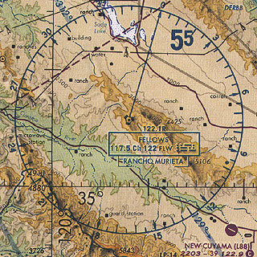
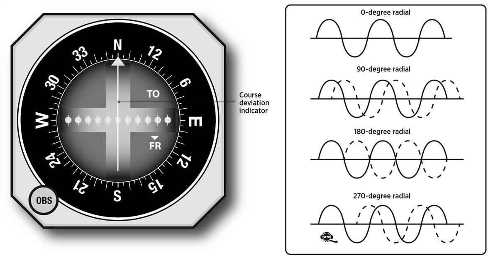
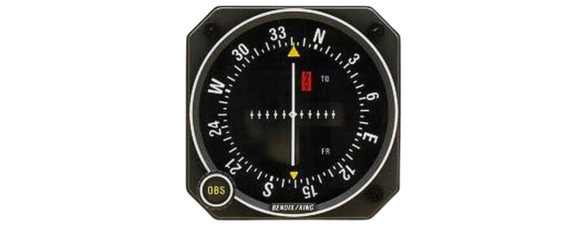
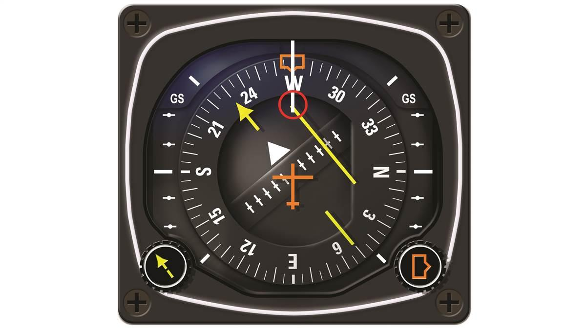
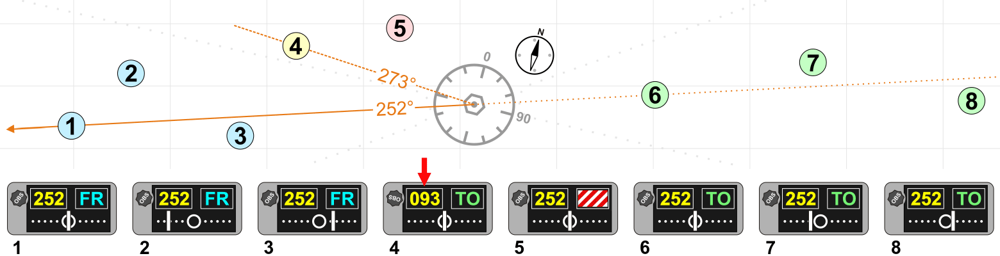

# VHF Omnidirectional Range

------------------------------------------------------------------------------------------------------------

Very High Frequency Omnirange Station (VOR) is a type of short-range radio navigation system for aircraft, enabling aircraft with a receiving unit to determine its position and stay on course by receiving radio signals transmitted by a network of fixed ground radio beacons. It uses frequencies in the very high frequency (VHF) band from 108.00 to 117.95 MHz. Developed in the United States beginning in 1937 and deployed by 1946, VOR became the standard air navigational system in the world, used by both commercial and general aviation, until supplanted by satellite navigation systems such as GPS in the early 21st century. As such, VOR stations are being gradually decommissioned. In 2000 there were about 3,000 VOR stations operating around the world, including 1,033 in the US, but by 2013 the number in the US had been reduced to 967. The United States is decommissioning approximately half of its VOR stations and other legacy navigation aids as part of a move to performance-based navigation, while still retaining a "Minimum Operational Network" of VOR stations as a backup to GPS.

A VOR ground station uses a specialized antenna system to transmit both an amplitude modulated and a frequency modulated signal. Both modulations are done with a 30 Hz signal, but the phase is different. The phase of one of the modulation signals is dependent on the direction of transmission, while the phase of the other modulation signal is not, in order to serve as a reference. The receiver will demodulate both signals, and measure the phase difference. The phase difference is indicative of the bearing from the VOR station to the receiver relative to magnetic north. This line of position is called the VOR "radial".

The intersection of radials from two different VOR stations can be used to fix the position of the aircraft, as in earlier radio direction finding (RDF) systems.

VOR stations are fairly short range: the signals are line-of-sight between transmitter and receiver and are useful for up to 200 nautical miles (370 kilometres). Each station broadcasts a VHF radio composite signal including the mentioned navigation and reference signal, station's identifier and voice, if so equipped. The station's identifier is typically a three-letter string in Morse code. The voice signal, if used, is usually the station name, in-flight recorded advisories, or live flight service broadcasts.

A VORTAC is a radio-based navigational aid for aircraft pilots consisting of a co-located VHF omnidirectional range and a tactical air navigation system (TACAN) beacon. Both types of beacons provide pilots azimuth information, but the VOR system is generally used by civil aircraft and the TACAN system by military aircraft. However, the TACAN distance measuring equipment is also used for civil purposes because civil DME equipment is built to match the military DME specifications. Most VOR installations in the United States are VORTACs. The system was designed and developed by the Cardion Corporation. The Research, Development, Test, and Evaluation (RDT&E) contract was awarded 28 December 1981.

## Operation

VORs are assigned radio channels between 108.0 MHz and 117.95 MHz (with 50 kHz spacing); this is in the very high frequency (VHF) range. The first 4 MHz is shared with the instrument landing system (ILS) band. In the United States, frequencies within the pass band of 108.00 to 111.95 MHz which have an even 100 kHz first digit after the decimal point (108.00, 108.05, 108.20, 108.25, and so on) are reserved for VOR frequencies while frequencies within the 108.00 to 111.95 MHz pass band with an odd 100 kHz first digit after the decimal point (108.10, 108.15, 108.30, 108.35, and so on) are reserved for ILS.

The VOR encodes azimuth (direction from the station) as the phase relationship between a reference signal and a variable signal. One of them is amplitude modulated, and one is frequency modulated. On conventional VORs (CVOR), the 30 Hz reference signal is frequency modulated (FM) on a 9,960 Hz subcarrier. Modern VORs use a circular array of typically 48 omni-directional antennas and no moving parts. The active antenna is moved around the circular array electronically to create a doppler effect, resulting in frequency modulation. The amplitude modulation is created by making the transmission power of antennas at e.g. the north position lower than at the south position. The role of amplitude and frequency modulation is thus swapped in this type of VOR. Decoding in the receiving aircraft happens in the same way for both types of VORs: the AM and FM 30 Hz components are detected and then compared to determine the phase angle between them.

The VOR signal also contains a modulated continuous wave (MCW) 7 wpm Morse code station identifier, and usually contains an amplitude modulated (AM) voice channel.

This information is then fed over an analog or digital interface to one of four common types of indicators:

A typical light-airplane VOR indicator, sometimes called an "omni-bearing indicator" or OBI is shown in the illustration at the top of this entry. It consists of a knob to rotate an "Omni Bearing Selector" (OBS), the OBS scale around the outside of the instrument, and a vertical course deviation indicator or (CDI) pointer. The OBS is used to set the desired course, and the CDI is centred when the aircraft is on the selected course, or gives left/right steering commands to return to the course. An "ambiguity" (TO-FROM) indicator shows whether following the selected course would take the aircraft to, or away from the station. The indicator may also include a glideslope pointer for use when receiving full ILS signals.

A radio magnetic indicator (RMI) features a course arrow superimposed on a rotating card that shows the aircraft's current heading at the top of the dial. The "tail" of the course arrow points at the current radial from the station and the "head" of the arrow points at the reciprocal (180° different) course to the station. An RMI may present information from more than one VOR or ADF receiver simultaneously.

A horizontal situation indicator (HSI), developed subsequently to the RMI, is considerably more expensive and complex than a standard VOR indicator but combines heading information with the navigation display in a much more user-friendly format, approximating a simplified moving map.

An area navigation (RNAV) system is an onboard computer with display and may include an up-to-date navigation database. At least one VOR/DME station is required for the computer to plot aircraft position on a moving map or to display course deviation and distance relative to a waypoint (virtual VOR station). RNAV type systems have also been made to use two VORs or two DMEs to define a waypoint; these are typically referred to by other names such as "distance computing equipment" for the dual-VOR type or "DME-DME" for the type using more than one DME signal.

While the operating principles are different, VORs share some characteristics with the localizer portion of ILS and the same antenna, receiving equipment and indicator is used in the cockpit for both. When a VOR station is selected, the OBS is functional and allows the pilot to select the desired radial to use for navigation. When a localizer frequency is selected, the OBS is not functional and the indicator is driven by a localizer converter, typically built into the receiver or indicator.

## Testing
Before using a VOR indicator for the first time, it can be tested and calibrated at an airport with a VOR test facility, or VOT. A VOT differs from a VOR in that it replaces the variable directional signal with another omnidirectional signal, in a sense transmitting a 360° radial in all directions. The NAV receiver is tuned to the VOT frequency, then the OBS is rotated until the needle is centred. If the indicator reads within four degrees of 000 with the FROM flag visible or 180 with the TO flag visible, it is considered usable for navigation. The FAA requires testing and calibration of a VOR indicator no more than 30 days before any flight under IFR.

### More Reading

### Videos

[VOR](https://youtu.be/KRSaSNeymNo?si=vSwxBAN2Q-JxOhm-)
